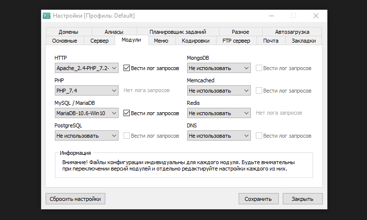
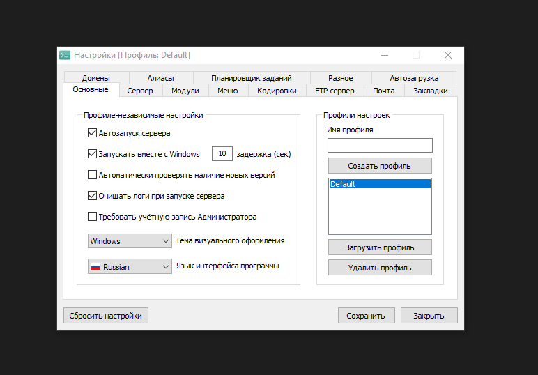
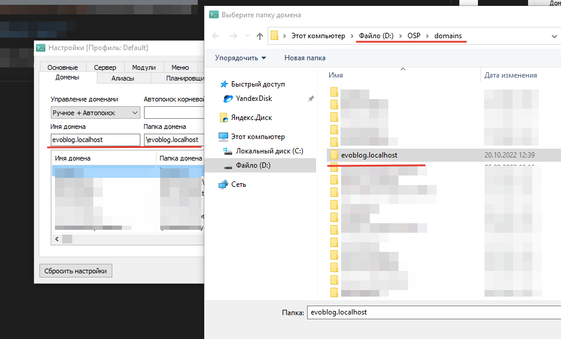
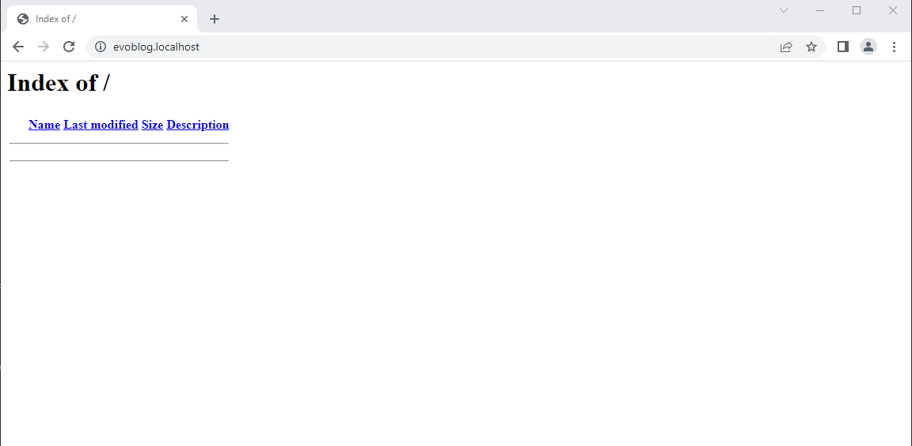
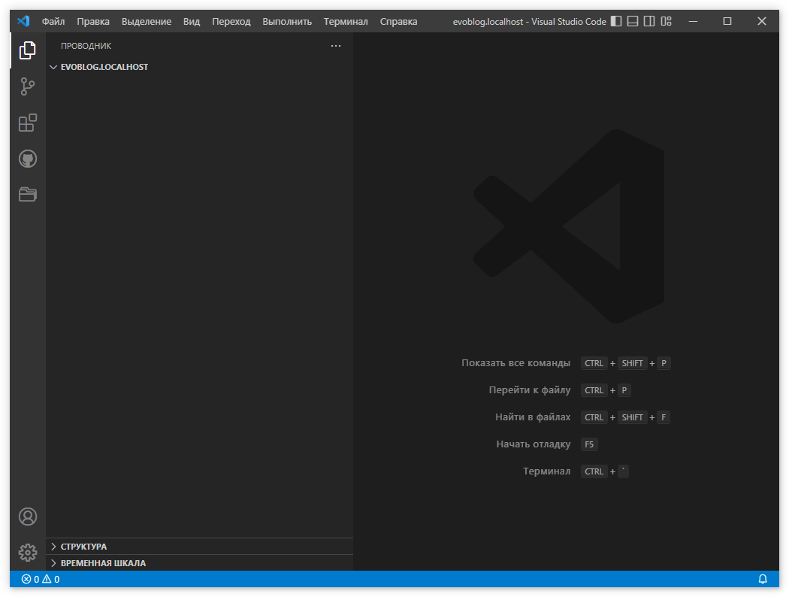

# Введение. Нужные программы

Наша задача - пошагово разработать и запустить блог на Evolution CMS 3-й версии.

## Оглавление

1. [Установка Openserver](#part1)
2. [Установка VSCode](#part2)

#### _Функциональность_

- главная страница со списком постов и тегов
- страница "Посты", где также будут посты, но уже с пагинацией
- страница одного поста
- текстовые страницы, например "Контакты"

## Установка и настройка Openserver <a name="part1"></a>

На момент написания этого текста Evolution CMS требует для работы веб-сервер с php >= 7.4 и mysql.
Я буду работать локально и использовать OpenServer под Windows. Вы можете использовать любые сочетания серверов и операционных систем. Скажем, сразу вести работы на сервере Ubuntu + Apache+ Nginx.

Скачать [Openserver](https://ospanel.io/) можно с сайта разработчика. Установка проходит, как правило, без проблем.

Я установил Openserver в папку `D:\OSP`.

### Настройки

#### _Общие настройки_

После установки сервера заходите в настройки, выбирайте версию php и версию базы данных.

> Чекбоксы "Вести лог" необязательны, но в сложной ситуации помогут отловить ошибку.

Мои настройки выглядят так:





#### _Настройки домена_

После того, как сделаны первоначальные настройки сервера, нужно добавить домен для сайта. Это делается в настройках, вкладка "Домены".

Я установил сервер в папку `D:\OSP`. Поэтому в папке `D:\OSP\domains` сервера я создаю папку `evoblog.localhost`.

Это будет доменом будушего сайта и рабочей папкой всего проекта. Разумеется, вы можете назвать его так, как вам хочется.

> Я по привычке добавляю ко всем сайтам, разрабатываемым в локальной среде, суффикс .localhost. Кто-то пишет сразу рабочий домен (evoblog.com), кто-то добавляет .loc - дело вкуса.



Добавляйте папку, перезапустите сервер и попробуйте открыть адрес `http://evoblog.localhost/`.
Поскольку директория пустая и мы не создали в ней ничего, вы увидите листинг файлов.



Это абсолютно нормальное поведение сервера, в дальнейшем картина изменится.

### Мелочи
По умолчанию Openserever не отображает пути с точкой в адресе. В Evolution есть как раз такой путь - файлы превьюшек в папке `.thumbs`
В файле конфигурации http (в моем случае Apache_2.4-PHP_7.0-7.4_server.conf) я удалил блок:

```
<LocationMatch "/\.(?!well-known)">
Require all denied
</LocationMatch>
```

## Установка VSCode <a name="part2"></a>

Работать я буду в среде VSCode - решение от компании Майкрософт.
Вы можете использовать phpStorm, SublimeText или любую другую ide по вашему выбору.

[Скачайте VSCode](https://code.visualstudio.com/) и установите.

Рекомендую также установить дополнения:

1. [Laravel Blade formatter](https://marketplace.visualstudio.com/items?itemName=shufo.vscode-blade-formatter) - форматирование шаблонов blade
2. [phpfmt - PHP formatter](https://marketplace.visualstudio.com/items?itemName=kokororin.vscode-phpfmt) - то же для php
3. [PHP Intelephense](https://marketplace.visualstudio.com/items?itemName=bmewburn.vscode-intelephense-client) - помощник для php, сам вставит и найдёт namespace, позволит перейти по клику в нужную модель/контроллер.

Опционально

1. [Settings Sync](https://marketplace.visualstudio.com/items?itemName=Shan.code-settings-sync) - для синхронизации настроек между разными компьютерами.
2. Любые доп. плюшки для визуального оформления, паки иконок, автокомплит тегов, html/css и т.д. Найти это всё можно, поискав обзоры плагинов для VSCode.
3. [Project Manager](https://marketplace.visualstudio.com/items?itemName=alefragnani.project-manager) - удобная штука, позволяет сохранять папку как проект и переключаться между ними.

Теперь открывайте VSCode, `Файл->Открыть папку` и выберите папку будущего сайта. У меня это папка `D:\OSP\domains\evoblog.localhost`, у вас она может отличаться.

Картина должна быть такая:



## Итог

- У вас должен быть работающий сервер и созданный домен `evoblog.localhost`, на который вы можете перейти в браузере.
- Среда разработки должна открываться и позволять работать в папке проекта.

---

Если всё хорошо, переходите к [установке Evolution CMS](/002_%D0%A3%D1%81%D1%82%D0%B0%D0%BD%D0%BE%D0%B2%D0%BA%D0%B0%20Evolution%20CMS.md).
