# Установка Evolution CMS #

Есть несколько способов, как вы можете установить систему.

В этом уроке будем использовать способ с файлом install.

- Скачайте файл [install.php](https://raw.githubusercontent.com/evocms-community/installer/master/install.php)
- Скопируйте его в директорую будущего сайта
- Запустите в браузере `http://evoblog.localhost/install.php`

Вы увидите примерно такую картину

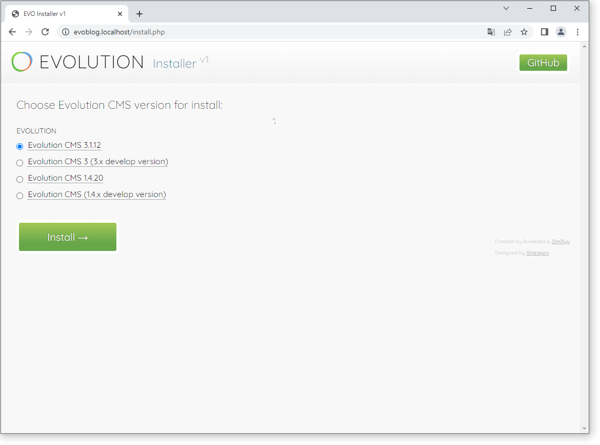

>Что может пойти не так? Ошибка может возникнуть только в случае, если вы сохранили файл как index.php.txt. Проверьте расширение.

Выберите стабильную (не develop) 3.х версию, жмите Install.

Сервер задумается и, спустя некоторое время, вы увидите интерфейс инсталлера.

Язык по вкусу, я выберу русский.

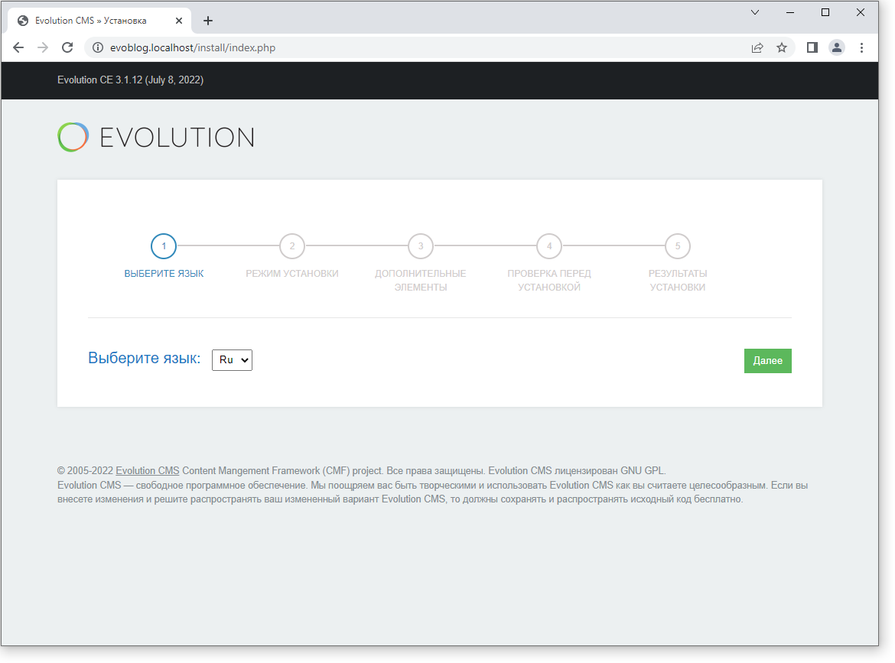

Режим установки в данном случае один. Когда мы будем обновлять систему, то здесь добавятся опции.

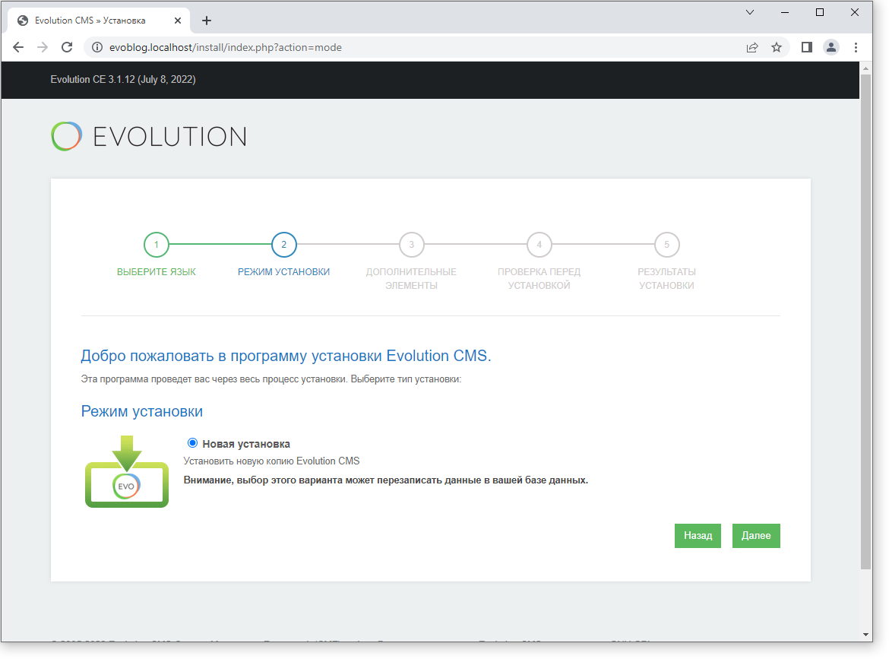

Мы добрались до самого важного. Параметры базы данных.

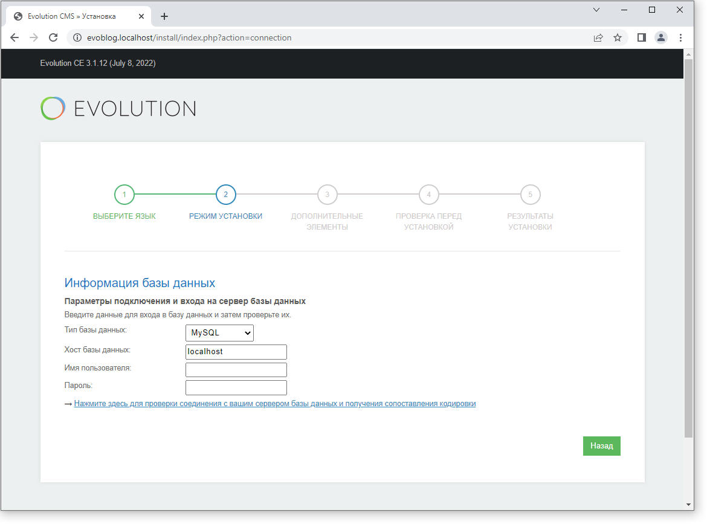

Если вы работаете на удалённом сервере, эти параметры вам должен предоставить сервис хостера. 

В нашем случае хостером являемся мы сами и заняться базой придётся самим.
Откройте правой кнопкой в трее меню сервера и найдите там phpMyAdmin.

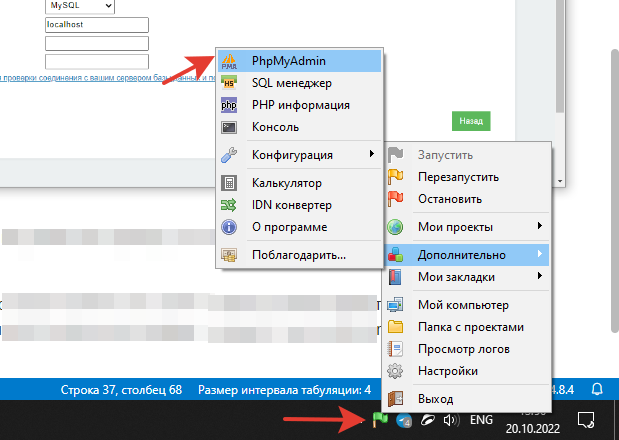

Сервер спросит логин и пароль. Если вы не меняли настройки, то логин будет `root`, а пароль пустой.

Заходим на сервер и переходим в пункт меню "Учетные записи пользователей"

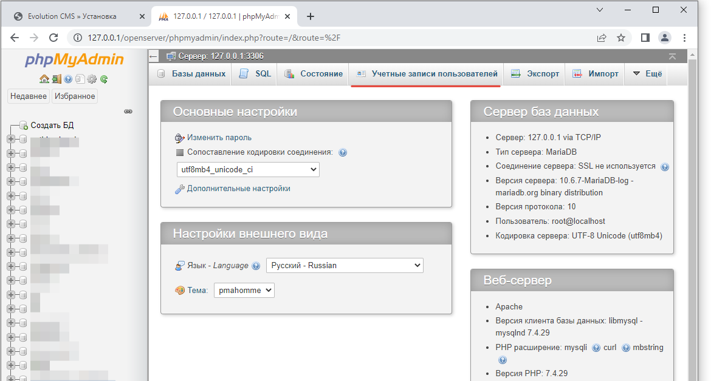

Добавьте нового пользователя и не забудьте отметить чекбокс, который создаст ему базу данных.

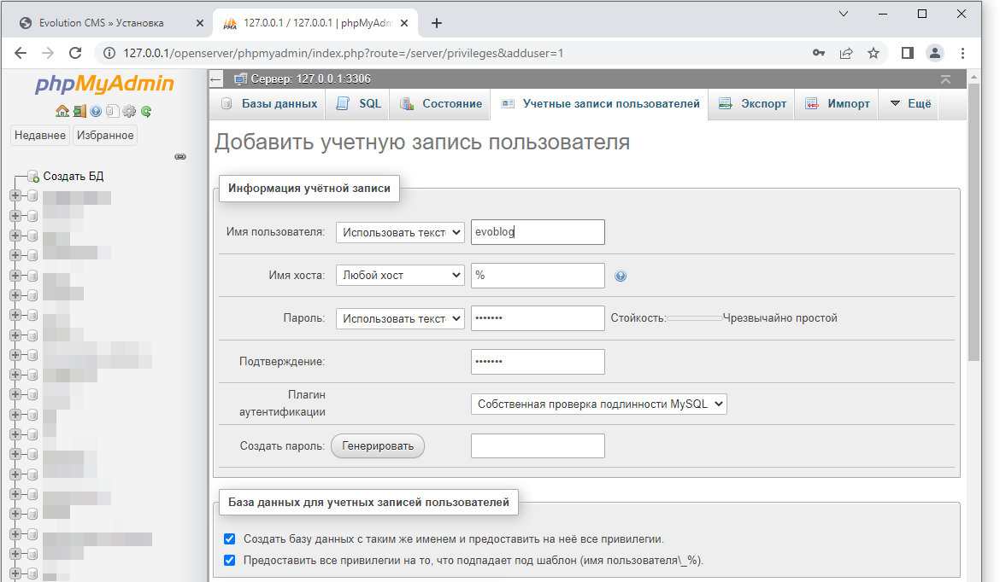

Я создал пользователя `evoblog`, задал ему такой же пароль.
Поскольку мы отметили чекбокс с созданием бд, PhpMyAdmin создал базу данных `evoblog` и назначил её владельцем этого пользователя.

Теперь перейдите в эту базу данных, выберите меню "Операции" и проверьте, какая кодировка (сравнение) задана. 

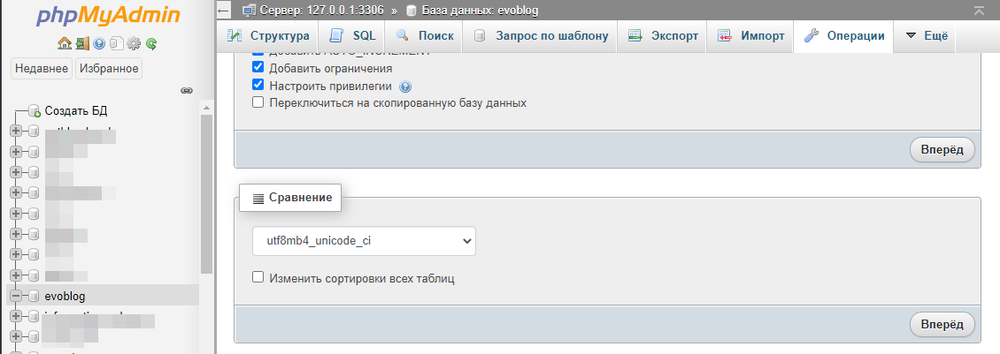

Я рекомендую задать кодировку `utf8mb4_general_ci`.

Возвращаемся к установке и вводим все данные в нужные поля.
Придумываем логин админа, пароль и жмём "Далее".

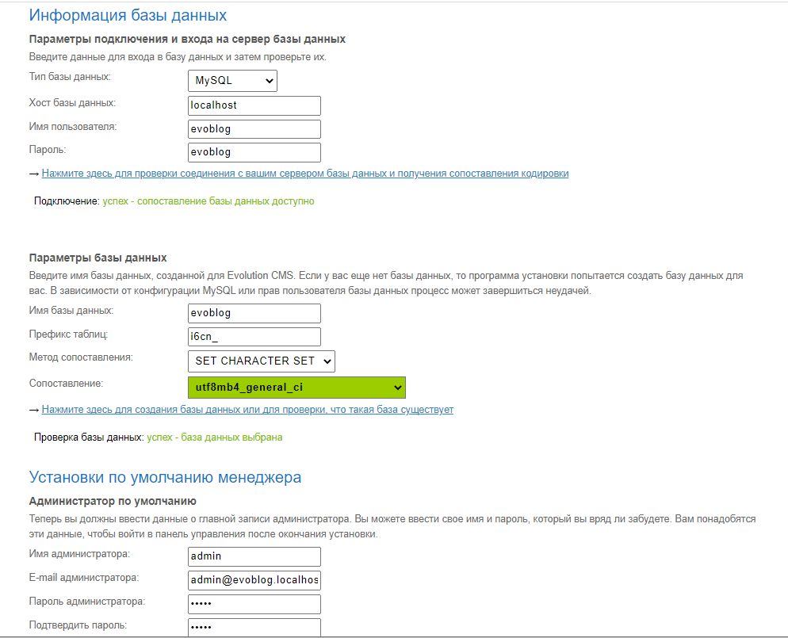

Следующий экран оставляем без изменений. Это список дополнений, которые будут установлены вместе с сайтом.

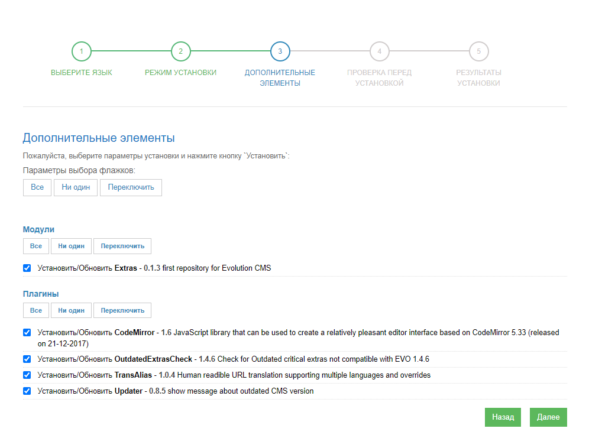

Дальше Evolution CMS проверит окружение -- версии php, mysql, права доступа к папкам и соединение с БД.

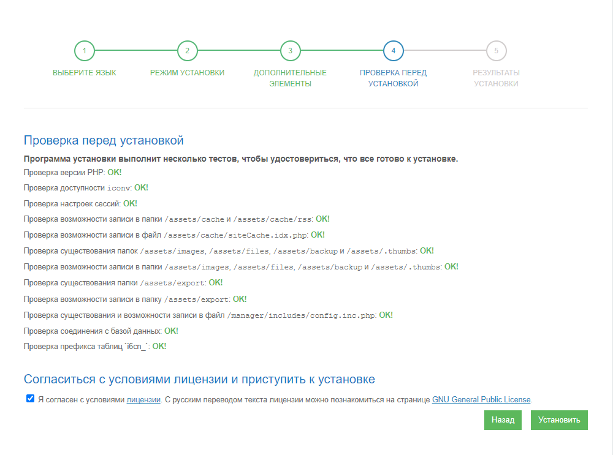

Если всё корректно, продолжайте установку.

> Частая ошибка - неподходящая версия php. Решается либо настройкой сервера, либо письмом к хостеру. Бывают и неверные параметры подключения к БД, но реже.

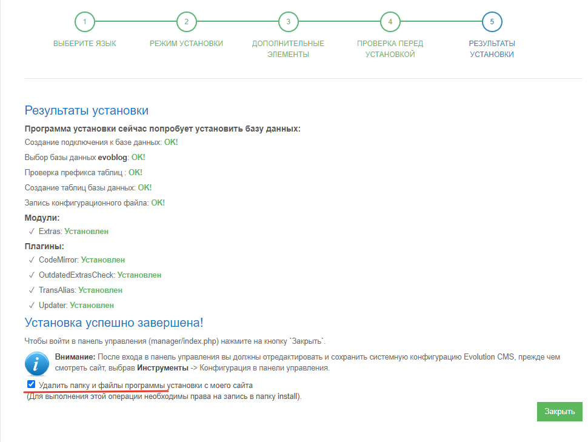

Если вы всё делали правильно, установка на этом закончена. Пора переходить в админ-панель.

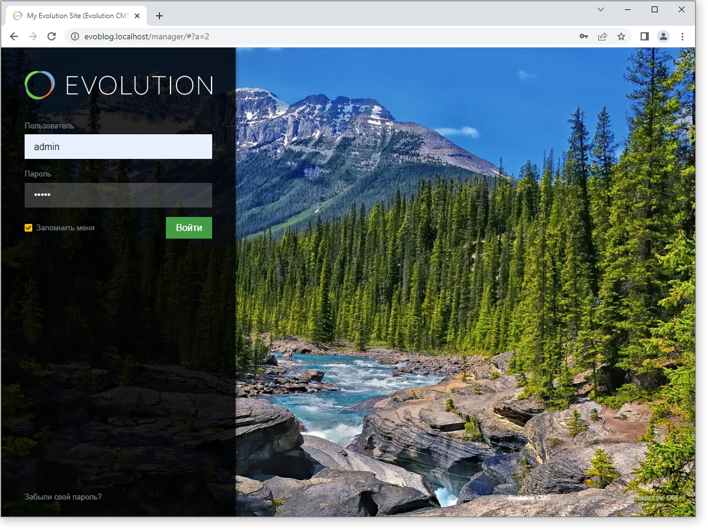

Вводите логин и пароль, жмите "Войти".

Evolution CMS поприветствует вас просьбой сохранить конфигурацию системы. Пока что ничего не меняем, просто жмём "Сохранить".

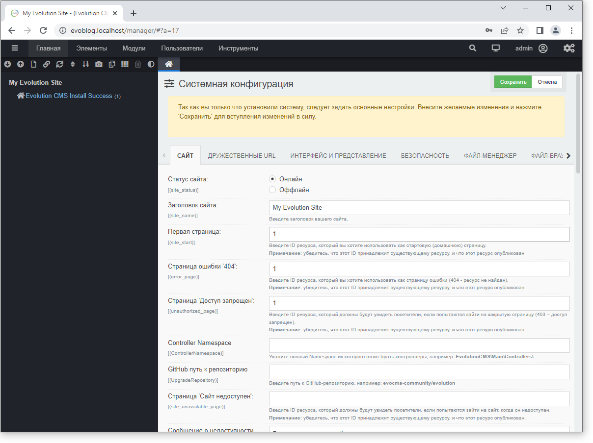

**Важно**
После окончания установки проконтролируйте, что папка `/install/` удалена из корневой директории сайта.

Теперь перейдите по адресу http://evoblog.localhost/ - вы должны страницу с сообщением "Install Successful!".

А если открыть VSCode, то папка сайта будет вот такой

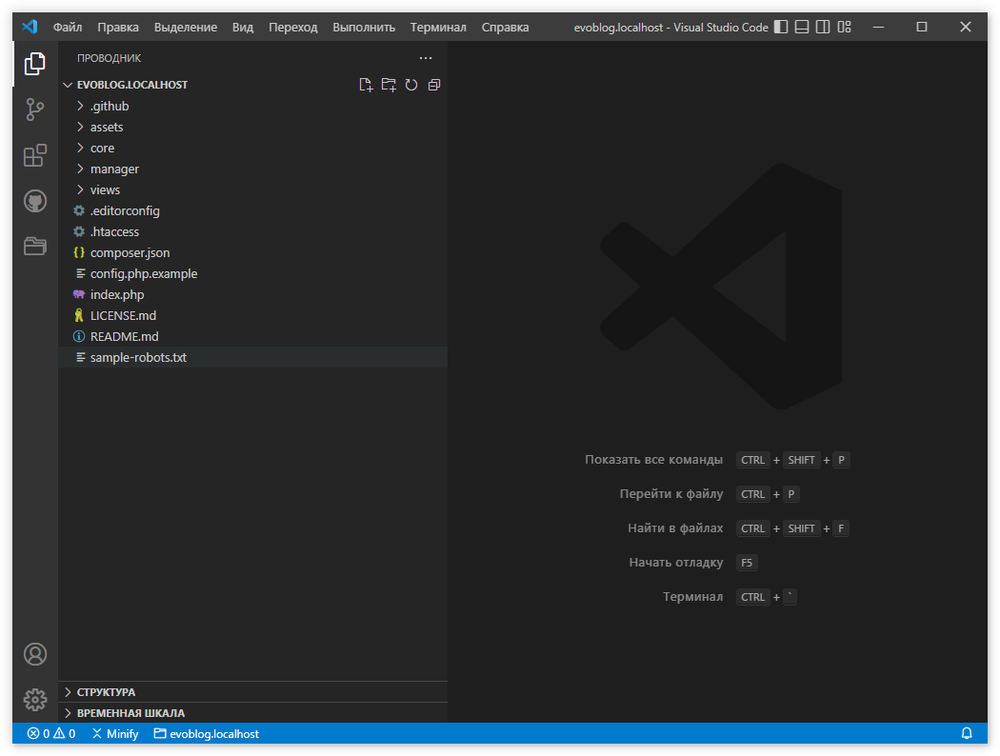

**Итог**
* У вас должен быть работающий пустой сайт по адресу `evoblog.localhost`
* Вы должны без проблем заходить в админ-панель этого сайта по адресу `evoblog.localhost/manager`.

Если всё хорошо, переходите к [первоначальным настройкам](/003_%D0%9F%D0%B5%D1%80%D0%B2%D0%BE%D0%BD%D0%B0%D1%87%D0%B0%D0%BB%D1%8C%D0%BD%D1%8B%D0%B5%20%D0%BD%D0%B0%D1%81%D1%82%D1%80%D0%BE%D0%B9%D0%BA%D0%B8.md).