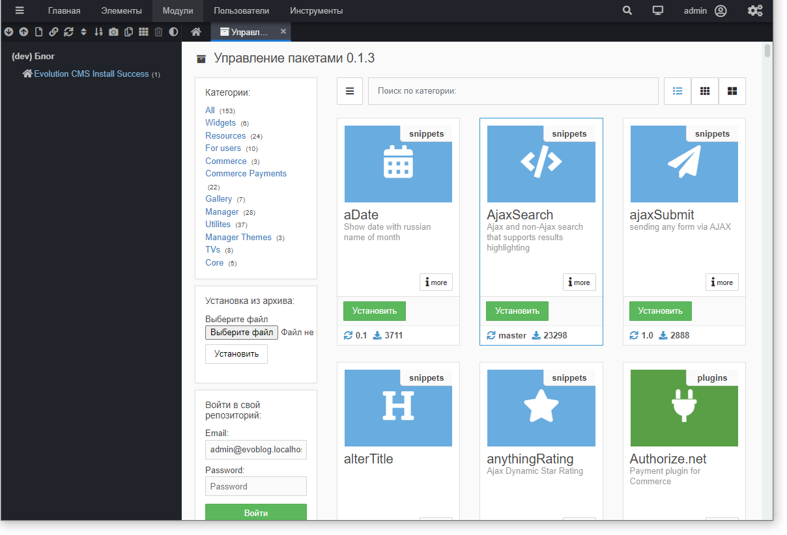

# Первоначальные настройки

Давайте настроим некоторые нужные параметры и установим дополнения.

Здесь и в дальнейшем я пишу пути к файлам от корня сайта без указания полного пути с диском и папкой сервера.
> Т.е. если написано
`core\custom\.env.example` - это файл `D:\OSP\domains\evoblog.localhost\core\custom\.env.example`

В уроке много кода - это лишь примеры и они очень просты. Не стоит сразу ужасаться и, с криком "я не програмист" закрывать документ. Просто внимательно прочитайте текст и вы всё поймёте.

Оглавление
1. [Конфигурация](#part1)
2. [Настройки сайта](#part2)
3. [Ставим дополнения](#part3)

## Конфигурация <a name="part1"></a>

### Конфигурация по-умолчанию
Сразу после установки Evolution CMS создаётся файл `core\config\database\connections\default.php`, где сохраняются  настройки подключения к базе данных.

Откройте его и изучите - там указываются те данные, которые мы вводили на этапе установки.
```php
<?php
return [
    'driver' => env('DB_TYPE', 'mysql'), // тип БД
    'host' => env('DB_HOST', 'localhost'), // сервер
    'port' => env('DB_PORT', '3306'), // порт
    'database' => env('DB_DATABASE', 'evoblog'), // имя базы
    'username' => env('DB_USERNAME', 'evoblog'), // пользователь
    'password' => env('DB_PASSWORD', 'evoblog'), // пароль
    'unix_socket' => env('DB_SOCKET', ''),
    'charset' => env('DB_CHARSET', 'utf8mb4'), // кодировка соединения
    'collation' => env('DB_COLLATION', 'utf8mb4_general_ci'), // сравнение
    'prefix' => env('DB_PREFIX', 'i6cn_'), // ПРЕФИКС таблиц
    'method' => env('DB_METHOD', 'SET CHARACTER SET'), //вряд ли нужно будет
    'strict' => env('DB_STRICT', false),	// режим работы БД. Бывает, что надо править
    'engine' => env('DB_ENGINE', 'myisam'),	// редко, но правим
    'options' => [
        PDO::ATTR_STRINGIFY_FETCHES => true,
    ]
];
```
Если вам придётся когда-то переносить сайт с одного хостинга на другой или с локальной машины на хостинг, настройки подключения должны быть изменены именно здесь.

>Но только в случае, если сайт не использует конфигурацию в .env файле.

Разберёмся подробнее, что это за .env и почему он может затереть все изменения default файла.

### Конфигурация в .env

Конфигурация может быть унесена в файл окружения -- это фишка из Laravel. Я рекомендую  это делать *всегда*. И, разумеется, в блоге мы это сделаем.

**Зачем это нужно?**

Сайт не всегда будет лежать только на локальном сервере. Вы перенесёте его на хостинг. Разумеется, можно править сайт сразу на "боевом" сервере, но это сгодится разве что для сайтов с нулевой посещаемостью. По уму правки вносятся на локалке, и потом файлы синхронизируются с сервером.

Сайт на локальной машине подключается к своей базе данных. Сайт на хостинге -- к своей. У них могут быть (и будут) разные пользователи, разные пароли, порт и драйвер базы данных.

Каждый раз после внесения правок на локалке и переноса файлов на боевой сервер править конфигурационный файл очень неудобно. Можно легко запутаться и потом долго искать причины 500-й ошибки.

Даже если вы не планируете работать с системами контроля версий типа github/gitlab, то будет логичным создать некий файл, который был бы не включен в дистрибутив системы (чтобы не затереть его обновлениями), но при этом позволял бы задавать эти настройки. 
Такой файл есть. 

**Приступим**

Сделаем независимые настройки для нашего локального блога.

Сначала открывайте "Системную информацию". Пусть остаётся открытой, отсюда вы будете копировать нужные значения.


Откройте папку `evoblog.localhost\core\custom\` и найдите там файл `.env.example`. 
Сделайте копию и переименуйте её в `.env`.

**Заполните файл .env**

У меня получилось что-то такое. Обратите внимание на правильные пути, префикс бд, кодировку, db strict, протокол сайта. Это наиболее частые места ошибок.

```php
DB_TYPE=mysql
DB_HOST=localhost
DB_USERNAME=evoblog
DB_PASSWORD=evoblog
DB_CHARSET=utf8mb4
DB_COLLATION=utf8mb4_unicode_ci
DB_METHOD="SET NAMES"
DB_DATABASE=evoblog
DB_PREFIX=i6cn_
DB_SOCKET=
DB_STRICT=false
CORE_CLASS=\DocumentParser
HTTPS_PORT=443
COOKIE_PATH=
COOKIE_DOMAIN=
MODX_BASE_PATH=D:/OSP/domains/evoblog.localhost/
MODX_BASE_URL=/
MODX_SITE_URL=http://evoblog.localhost/
MODX_SITE_HOSTNAMES=evoblog.localhost
MGR_DIR=manager
MODX_MANAGER_PATH=D:/OSP/domains/evoblog.localhost/manager/
MODX_MANAGER_URL=http://evoblog.localhost/manager/
```

Сохраните файл и перейдите в админку сайта. Всё должно работать без ошибок. Если это не так, проверяйте внимательно каждую строку. Особенно все любят не убирать слово /public/ из MODX_BASE_PATH и MODX_MANAGER_PATH.


>Если вы пока что не планируете никуда ничего переносить, пропустите следующий абзац и вернитесь к нему позже, в момент переноса сайта на боевой сервер. (Когда сроки поджимают и надо  сделать "вчера" - самое время изучить документацию, не так ли?)

Вы должны настроить свой файловый менеджер(либо git репозиторий) так, чтобы этот файл никогда не перезаписывался. В случае с гит -- просто добавьте его в `.gitignore`. Если вы используете WinSCP, то изучите его опцию "настройки передачи". Для других файловых менеджеров могут быть свои настройки. 
После переноса файлов на сервер нужно будет создать этот файл уже там и корректно его заполнить исходя из тех данных, которые вам предоставим хостер. Мы разберём перенос гораздо позже, но готовиться начали уже сейчас.

## Настройки сайта <a name="part2"></a>

Теперь нужно немного настроить наш сайт, чтобы было удобнее. Ищите справа иконку шестерёнки и открывайте страницу "Системная конфигурация"


Рекомендую неспеша сесть и изучить каждую вкладку этой страницы. Запоминать каждую опцию, разумеется, нет смысла. Однако вы хотя бы в общих чертах будете представлять, что можно настроить в системе.

**Что я рекомендую настроить:**
* Название сайта - впишите сюда "Блог"
* Автоматическое назначение шаблона - "соседний". Эта настройка даст возможность быстрее создавать однотипные документы, т.к. документы будут создавать автоматически с тем же шаблоном, что и соседи.
* Способ кэширования - "Отключить для администраторов". Кэш при разработке будет только мешать.

**Вкусовщина**

* Добавлять слэш к контейнеру - "Да". Чтобы адреса были `/blog/`, а не `/blog`. Мне так почему-то комфортнее, сеошники могут поспорить.
* Группировать ТВ параметры - "Секциями на вкладке Общие". Я люблю, когда параметры показываются не в отдельных вкладках (ex Modx Revo), а сразу все и на одной странице. Так контент-менеджер будет видеть, что ему нужно заполнять и вряд ли пропустит поле.

### А если нужны разные настройки для локального и удалённого сайта?

Ситуация ровно такая же, как с файлом `.env`. Допустим, вы хотите, чтобы у сайта на локальном компьютере было имя "(dev) Блог", а у сайта в боевой среде - просто "Блог". Либо вы хотите настроить почту для локалки при помощи mailtrap, а в боевой среде уже вписывать настоящие данные ящиков вашей компании.

Такая возможность предусмотрена и работает она точно также, как и файл .env.

Ищем файл `core\custom\config\cms\settings.php.example`, копируем его и переименовываем в `settings.php`.

Внутри пишем
```php
return [
    'site_name' => '(dev) Блог'
];
```
Формат этого файла -- массив с ключами и значениями. Где брать названия ключей?

Мы их только что видели - ключи указаны в "Системной конфигурации". Разумеется, в файле мы не пишем `[(фигурные скобки)]`, а копируем только значение (скобки это просто наследие версии Эво 1.4).


Обратите внимание, что настройки, указанные в файле, переопределяют всё, что мы указываем в настройках админки. Они главнее.

На данном этапе нас больше не интересует этот файл, но мы обязательно к нему вернёмся.

>Не забудьте исключить файл `core\custom\config\cms\settings.php` из репозитория или внести в исключения файл-менеджера.

**Совет**

Вы можете сформировать 3-4 разных файла `settings.php` для своих нужд и при создании нового сайта просто копировать их, сразу задавая все настройки сайта.

Пример и часть настроек
```php
<?php
return [

    'site_status' => 1,                                                 //  Статус сайта. 1 | 0
    'site_name' => 'dev NAME',                                          //  Заголовок сайта
    'site_start' => 1,                                                  //  Первая страница
    'error_page' => 1,                                                  //  Страница ошибки '404'
    'unauthorized_page' => 1,                                           //  Страница 'Доступ запрещен'
    'ControllerNamespace' => 'EvolutionCMS\\Main\\Controllers\\',       //  ControllerNamespace
    'UpgradeRepository' => 'evocms-community/evolution',                //  GitHub путь к репозиторию
    'site_unavailable_page' => '',                                      //  Страница 'Сайт недоступен
    'site_unavailable_message' => 'В настоящее время сайт недоступен.', //  Сообщение о недоступности сайта
    'siteunavailable_message_default' => 'ru',                          //  язык
    'default_template' => 1,                                            //  Шаблон по умолчанию
    'auto_template_logic' => 'sibling',                                 //  Автоматическое назначение шаблона. system - Системный | parent - Родитель | sibling - Соседний
    'chunk_processor' => 'DLTemplate',                                  //  Класс обработки чанков. DocumentParser | ''
    'publish_default' => 1,                                             //  'Публиковать' по умолчанию
    'cache_default' => 1,                                               //  'Кэшируемый' по умолчанию
    'search_default' => 1,                                              //  'Доступен для поиска' по умолчанию
    'auto_menuindex' => 1,                                              //  Индексация меню' по умолчанию
    'docid_incrmnt_method'  => 0,                                       //   Способ добавления Resource ID. 0 - DB автоинкримент | 1 - Минимальный пропущенный ID | 2 - Максимальный ID+1
    'enable_cache' =>  2,                                               //   Способ кэширования. 0 - Включено | 1 - Отключен | 2- Отключить для администраторов
    'disable_chunk_cache' => 0,                                         //  Отключить кэширование чанков
    'disable_snippet_cache' => 0,                                       //  Отключить кэширование сниппетов
    'disable_plugins_cache' => 0,                                       //  Отключить кэширование плагины
    'cache_type' => 2,                                                  //  Способ кэширования страниц.   1 - Только с учетом ID (стандартный метод) | 2 - C учетом ID и $_GET
    'minifyphp_incache' => 0,                                           //  Сжать код php в файле кэша
    'server_offset_time' => 0,                                          //  Разница во времени
    'server_protocol' => 'http',                                        //  Тип сервера. http | https
    'rss_url_news' => 'https://github.com/evocms-community/evolution/releases.atom',   //  Лента RSS новостей
    'track_visitors' => 0,                                              //  Показывать дочерние ресурсы
    'which_editor' => 'TinyMCE5',
    //'tinymce5_theme' => 'myconfig',
    'filemanager_path' => env('MODX_BASE_PATH'), 
    'rb_base_dir' => env('MODX_BASE_PATH') . 'assets/',
    'enable_cache' => 2,
    'login_form_position' => 'center',
    'login_form_style' => 'dark',
    'error_reporting' => 0,
    'failed_login_attempts' => 10,

];
```

## Ставим дополнения <a name="part3"></a>

Давайте установим дополнения, которые помогут нам работать с блогом.
Откройте "Модули" и найдите там Extras. Это модуль установки различных пакетов дополнений.

Нам потребуются: DocLister, FormLister, Selector, multiTV, ClientSettings.

Просто вводите эти названия в поисковую строку и жмите "Установить"



В процессе разработки вы поймёте, какое дополнение нужно и для чего. Сейчас не будем заострять на этом внимания.


**Итог:**
* У вас должен быть работающий пустой сайт по адресу `evoblog.localhost`
* Настройки сайта должны быть частично унесены в файл `core\custom\config\cms\settings.php`
* Настройки окружения сайта должны быть полностью в файле `core\custom\.env`
* Нужно понять, зачем мы сделали вынос настроек и как это пригодится в будущем.
* Должны быть поставлены дополнения из списка выше


Теперь переходим к самому интересному - [к шаблонизации и созданию структуры](/004_%D0%A1%D1%82%D1%80%D1%83%D0%BA%D1%82%D1%83%D1%80%D0%B0%20%D1%81%D0%B0%D0%B9%D1%82%D0%B0%20%D0%B8%20%D1%88%D0%B0%D0%B1%D0%BB%D0%BE%D0%BD%D1%8B.md) нашего блога.