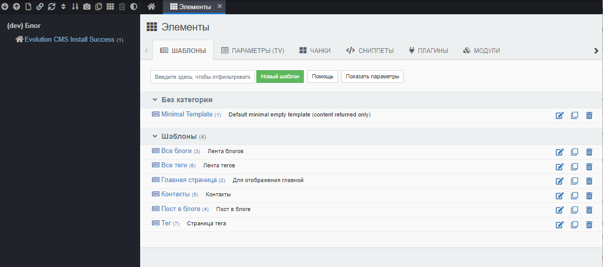

# Структура сайта и шаблоны в Evolution CMS

* [Введение](#part1)
* [Создаём шаблоны](#part2)
* [Создаём структуру сайта](#part3)
* [Про URL](#part4)


## Введение  <a name="part1"></a>

Шаблонам в Evolution CMS уделяется очень внимания. Я бы назвал шаблон единицей смысла, структуры и дизайна.

За что отвечает шаблон?

* внешний вид страницы
* тип отдаваемого содержимого
* дополнительные поля страницы
* имя контроллера для выдачи данных

Если проводить аналогии с другими cms, то ближайший аналог в Друпал - "тип материала", в Вордпресс - "тип контента" (посты,страницы).

И, как и в этих cms, шаблону могут быть назначены свои параметры, характерные именно для того типа контента, который он представляет.

**Пример**
Для шаблона "Новость" будет логичным задать параметр "Изображение новости". Для шаблона "Товар" не помешает параметр "Цена товара" и так далее.


## Создаём шаблоны <a name="part2"></a>
Создадим шаблоны, которые потребуются нам на этом этапе.

**Главная страница**

Заходим в "Элементы"-"Шаблоны" и создаём новый шаблон.


Обратите внимание на поле "псевдоним" и чекбокс "Создать файл шаблона при сохранении". Это нам обязательно будет нужно в дальнейшем.

Также я указываю категорию "Шаблоны", куда буду привязывать все шаблоны на сайте. Название произвольное, это нужно только для поддержания порядка на сайте.

Вот таблица, где расписано, какие имена, псевдонимы и описания нужно задать шаблонам.

| Имя				|    Псевдоним      |  Описание  	|
|-------------------|:-----------------:|--------------:|
| Главная страница	|	main			| Для главной 	|
| Все блоги 		|	blogs   		| Лента блогов	|
| Пост в блоге		|	post   			| Пост в блоге	|
| Контакты 			|	contacts 		| Контакты		|
| Все теги 			|	tags 			| Лента тегов 	|
| Тег 				|	tag 			| Страница тега 	|


Сделайте эту работу и сравните результаты с моими. 

 

Разумеется, в дальнейшем вы вполне можете называть шаблоны так, как вам захочется. Это же справедливо и для поля "описание". А вот с псевдонимом я бы воздержался от дефисов и спецсимволов -  могут возникнуть проблемы.

**Внимание**
Псевдоним в шаблоне не имеет никакого отношения к URL. Это именно англоязычное название для шаблона, которое нам понадобится впоследствие.

## Создаём структуру сайта <a name="part3"></a>

Теперь пришло время создать черновую структуру сайта в админке.
Слева в дереве вы уже видите первую страницу. Зайдите в редактирование и смените ей шаблон на "Главная страница".

 

 Поизучайте поля. Переименуйте"Заголовок" в "Главная страница блога". Поле "Расширенный заголовок" и поле "Пункт меню" очистите. Сохраните страницу. 

 **Важно**
 А вот в ресурсах поле "псевдоним" имеет самое прямое отношения к УРЛ. Это как раз и есть ЧПУ вашей страницы. По умолчанию генерируется автоматически путём транслитерации заголовка.

 Теперь будем делать структуру сайта. Слева сверху найдите иконку "Новый ресурс" и, используя её, добавьте новый ресурс. 


 

 Какая структура нам нужна?

* Главная страница (*шаблон "Главная страница"*)
* Все блоги (*шаблон "Все блоги"*, псевдоним blogs)
	* Запись в блоге (*шаблон "Пост в блоге"*)
	* ...
* Теги (*шаблон "Все теги"*, псевдоним tags)
	* Тег (*шаблон "Тег"*)
	* ...
* Контакты (*шаблон "Контакты"*, псевдоним contacts)

Для создания вложенных ресурсов типа тегов или постов в блоге нажмите на правую кнопку мыши на родительском ресурсе и в меню выберите "Дочерний ресурс".

 
 
Кстати, для тегов и постов не обязательно указывать псевдоним, пусть cms генерирует его сама. Мы указали псевдонимы только для важных сущностей, таких так общая страница всех блогов, страница тегов, страница контактов.

Давайте сравним, что получилось у меня и у вас:


## Зависимость URL от структуры <a name="part4"></a>

Откройте пост для редактирования и найдите сверху кнопку "Просмотр". Нажмите её и обратите внимание, по какому адресу открылся документ.
```
http://evoblog.localhost/blogs/post-o-chyom-to.html
```
Evolution CMS сгеренировала адрес, отталкиваясь от расположения ресурса. Пост лежит в папке "Блоги", которая имеет псевдоним `blogs`. Сам пост имеет псевдоним (у меня) `post-o-chyom-to`.  Система сделала адрес, основываясь на структуре сайта и добавила суффикс `.html`. 

**Важно**
Делаем вывод -- структура важна не только для того, чтобы администратор сайта знал,  где что лежит, но и для формирования адресов сайта. Это важно.


>Кстати, суффикс или его отсутствие вы можете настроить в конфигурации. Самое время поэкспериментировать с вкладкой "Дружественные URL".

Зайдите в настройки сайта, откройте вкладку "Дружественные URL", найдите "Суффикс для дружественных URL". Давайте его уберём - пусть генерируется чистый адрес без всяких суффиксов из 2001 года.

Можно просто очистить поле в админ-панели и нажать "сохранить". Но, поскольку мы работаем с файлом settings.php, то изменения внесём там. Ищем название ключа, дописываем его в массив и задаём пустое значение.

```php
return [
/*
 *	тут у вас всякие другие параметры
 */
    'friendly_url_prefix' => '',
];
```
Попробуйте открыть пост снова.  Адрес должен измениться на `http://evoblog.localhost/blogs/post-o-chyom-to`.


**Итого**
* Созданы нужные шаблоны
* Создана структура сайта внутри админ-панели
* Снаружи пока без изменений - сайт пустой
* Мы изменили схему генерации URL - убрали суффикс у конечных страниц

Отлично. Теперь пора разобраться с ТВ-параметрами: добавить постам картинки, сеошные теги и разные мелочи.


