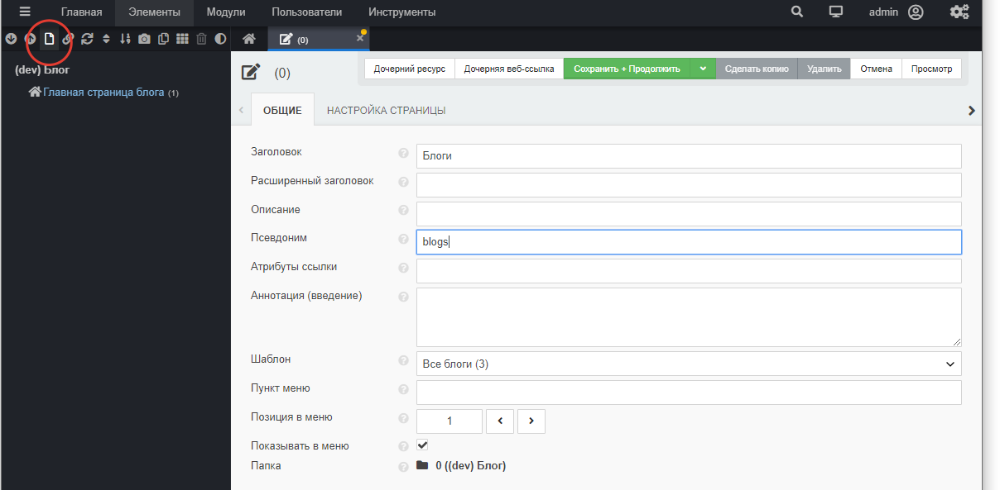

# ТВ-параметры в Evolution CMS

## Оглавление

- [Введение в TV](#part1)
- [Создаём ТВ](#part2)

## Введение в TV 

ТВ-параметры правильнее назвать TV, поскольку template variables - переменные шаблона.
Но в сообществе давно устоялись термины наподобие "тв", "твшка". Будем их придерживаться (мне лень переключать клавиатуру).

### Описание

ТВ-параметры позволяют добавить к ресурсу дополнительную информацию, которую затем можно использовать наравне с основными полями.

Основные поля - это те поля, что вы можете увидеть, открыв для редактирования любой документ, который мы создали.

Количество основных полей впечатляет, однако, они могут покрыть далеко не все нужды даже для простого сайта.

### Для чего нужны TВ-параметры?

TВ-параметр нужен для упорядоченного и логичного хранения информации на сайте.

Представьте, что на сайте есть 2 типа материалов - товары и новости. Для товара можно создать два параметра. В одном будет храниться цена, в другом фотография. А для поста в блоге создать другие параметры - теги и аннотацию.

> Зачастую TВ-параметры используются для создания SEO-полей наподобие meta description, keywords и т.д.

### ТВ имеют разные типы

ТВ имеют различные типы и в зависимости от этого меняется их поведение и внешний вид.
Можно создать параметр, где пользователь сможет писать текст, а можно сделать и выбор файла/файлов.

### ТВ привязываются к шаблону

Именно это свойство позволяет точно и логично привязать нужные параметры нужным типам материала. Если ТВ-параметр "Цена" назначен шаблону "Товар", редактор сайта никогда не увидит цену, создавая "Новость".

## Создаём ТВ для блога 

Для блога нам понадобятся следующие параметры:

| Имя             | Заголовок            |               Описание | Категория |
| --------------- | -------------------- | ---------------------: | --------- |
| metatitle       | Meta title           |   Содежимое тега title | SEO       |
| metadescription | Meta description     | Содержимое description | SEO       |
| post_mainphoto      | Главное фото к посту |           Главное фото | Контент   |
| post_tags       | Теги поста           |                   Теги | Контент   |

Я разбил список на две категории (SEO и Контент), чтобы мы могли их вынести в отдельные секции, это удобно.

Создаём параметр:

Значения полей:

|                                        |             |                                                                   |
| -------------------------------------- | ----------- | ----------------------------------------------------------------- |
| Имя параметра                          | требуется   | латиницей без спецсимволов, допустимы подчёркивания, цифры и тире |
| Заголовок                              | опционально | любое, понятное вам название                                      |
| Описание                               | опционально | иногда нужно                                                      |
| Новая категория/Существующая категория | опционально | для структурирования параметров и порядка                         |
| Тип ввода                              | важно       | определяет, как будет выглядеть поле ввода этого параметра        |
| Шаблоны                                | важно       | список шаблонов, где ТВ-параметр будет показан                    |

Варианты типов ввода для TV-параметров можно изучить в документации.

Выберите для сео-параметров все шаблоны. Мы ведь будем настраивать ключевые слова и тайтл для все ресурсов сайта.

Задайте им категорию "СЕО". Такой категории нет, она будет создана после сохранения ТВ, если вы ввели название в поле "Новая категория". В дальнейшем просто выбирайте её из списка.

А вот для параметра "Главное фото к посту" и "Теги поста" шаблон нужно выбрать только один - "Пост в блоге".

И, поскольку эти параметры не текстовые, тип нужно указать Image для фотографии:

И Selector для тегов

Задайте им категорию "Контент".

**Важно:** Тип ввода `selector` отсутствует в системе по умолчанию, он появляется после установки одноименного дополнения Selector. Если вы не видите такого типа ввода, вернитесь в [третий урок](/003_%D0%9F%D0%B5%D1%80%D0%B2%D0%BE%D0%BD%D0%B0%D1%87%D0%B0%D0%BB%D1%8C%D0%BD%D1%8B%D0%B5%20%D0%BD%D0%B0%D1%81%D1%82%D1%80%D0%BE%D0%B9%D0%BA%D0%B8.md) - там мы установили Selector в числе прочих дополнений.

### Проверка

Давайте проверим себя и заодно посмотрим, как выглядят наши параметры.

Откройте главную страницу.

Вы должны увидеть секцию СЕО и два созданных параметра.

Теперь откройте пост в блоге. У вас должна присутствовать секция СЕО и секция Контент.

Теги пока пропустим, а вот изображение вы можете совершенно спокойно закачивать (жмите "Вставить"). Оно должно отобразиться в админ-панели.

> Кстати, способ размещения ТВ-параметров в ресурсе вы можете настроить. В одном из прошлых занятий мы указали в настройках сайта опцию "Группировать ТВ-параметры - "Секциями на вкладке Общие".
> При желании вы можете даже вынести их в отдельные вкладки сверху.

**N.B.:** Давайте включим визуальный редактор TinyMCE4, чтобы заполнять блог было удобнее. Зайдите в конфигурацию сайта и во вкладке "Интерфейс и представление" выберите `"Редактор" - TinyMCE4`. Теперь при открытии поста вы увидите привычный интерфейс редактора в поле content.

## Итого

- Сайт работает. Есть структура.
- У постов есть четыре тв-параметра, у других страниц два.
- Снаружи всё ещё пусто, но мы можем наполнять блог.

---

Если всё хорошо, то [настало время дизайна](/006_%D0%A8%D0%B0%D0%B1%D0%BB%D0%BE%D0%BD%20%D0%B1%D0%BB%D0%BE%D0%B3%D0%B0.%20%D0%98%D0%BD%D1%82%D0%B5%D0%B3%D1%80%D0%B0%D1%86%D0%B8%D1%8F%20%D0%B4%D0%B8%D0%B7%D0%B0%D0%B9%D0%BD%D0%B0%20%D0%B2%20Evolution%20CMS.md).
