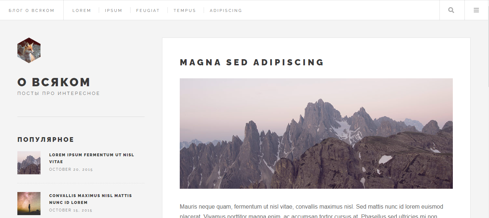
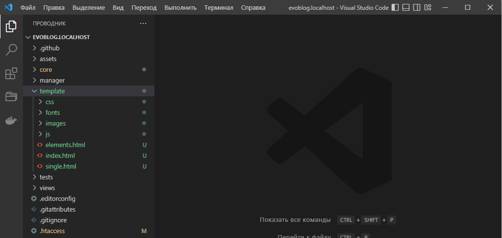
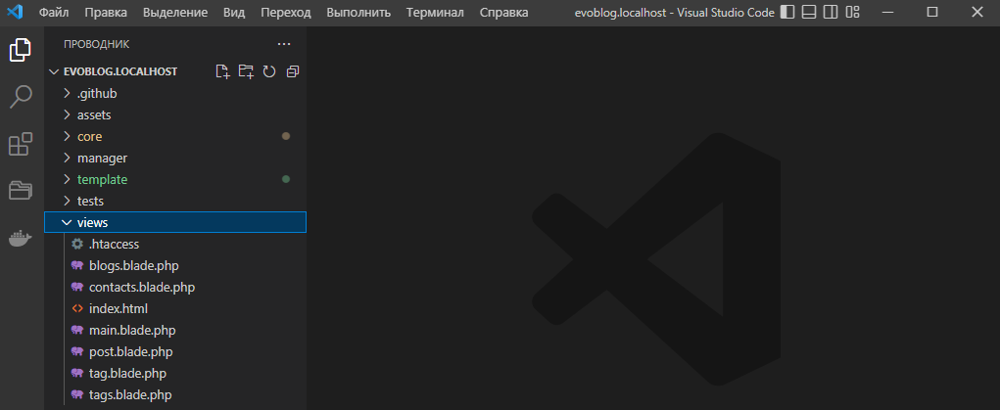
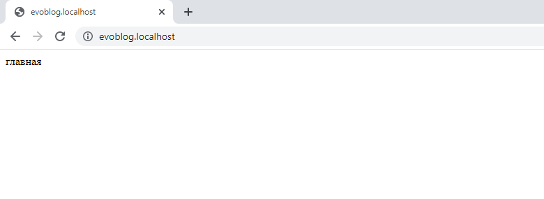
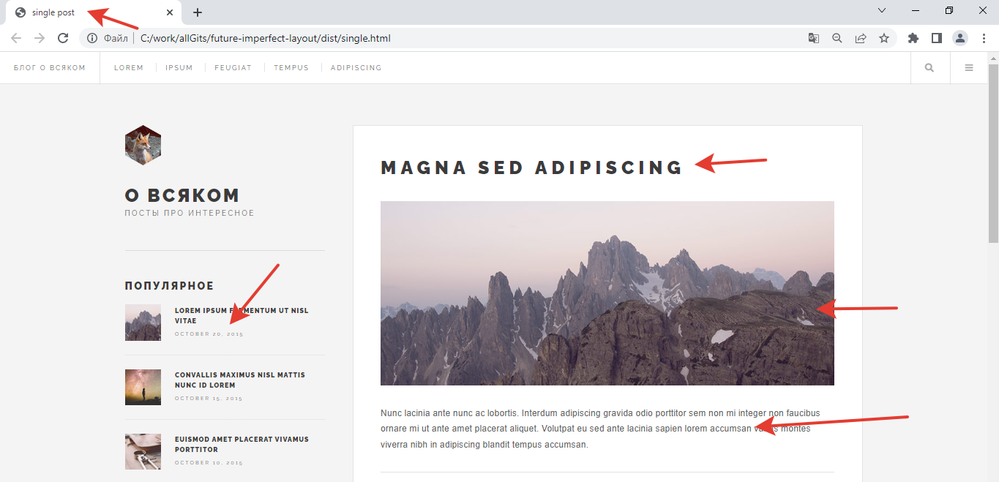

# Шаблон блога. Интеграция дизайна в Evolution CMS

Оглавление
* [Про будущий дизайн](#part1)
* [Копируем дизайн](#part2)
* [Связь псевдонима и файла шаблона](#part3)
* [Проверка](#part4)
* [Blade](#part5)

## Про будущий дизайн 

Для начала скачайте html-шаблон. Репозиторий лежит на 
[моём гитхабе](https://github.com/0test/future-imperfect-layout).

Жмите `Code -> Download ZIP`, либо клонируйте к себе, если умеете работать с git.

Шаблон будет дорабатываться исходя из потребностей и дальнейших уроков. На данный момент там есть три страницы:
* index.html - главная,
* single.html - страница поста,
* elements.html - набор разных элементов.

**Что это за app, dist, package?**

Не обращайте внимания ни на что, кроме папки `dist`. Именно там хранится привычный html-код шаблона.

>Остальные файлы и папки я сделал для облегчения вёрстки при помощи gulp. Если вам знаком этот термин, то в папке app вы можете найти исходные файлы, отредактировать шаблон и скомпилировать его под себя.

Так что открывайте index.html и смотрите, что мы будет делать.

## Копируем дизайн 

В Evolution CMS нет строгого требования к папке, где должны быть размещены изображения, js и css файлы шаблона.

Создайте папку `template` в корне сайта, и скопируйте туда всё содержимое папки `dist` из репозитория.

Файлы *.html можно не копировать, они ни на что не влияют. Просто в дальнейшем так удобнее таскать оттуда кусочки кода.

## Вспоминаем про шаблоны

На [четвёртом занятии](/004_%D0%A1%D1%82%D1%80%D1%83%D0%BA%D1%82%D1%83%D1%80%D0%B0%20%D1%81%D0%B0%D0%B9%D1%82%D0%B0%20%D0%B8%20%D1%88%D0%B0%D0%B1%D0%BB%D0%BE%D0%BD%D1%8B.md) мы делали шаблоны в админ-панели.
Мы даже использовали их, создавая структуру сайта.

Давайте вспомним, что мы создали, но теперь обратите внимание на поле "Псевдоним".

| Имя				|    Псевдоним      |  Описание  	|
|-------------------|:-----------------:|--------------:|
| Главная страница	|	main			| Для главной 	|
| Все блоги 		|	blogs   		| Лента блогов	|
| Пост в блоге		|	post   			| Пост в блоге	|
| Контакты 			|	contacts 		| Контакты		|
| Все теги 			|	tags 			| Лента тегов 	|
| Тег 				|	tag 			| Страница тега 	|

В тот момент он был нам не важен. Теперь настало время его использовать.

## Связь псевдонима и файла шаблона 

Откройте папку `views` в корне сайта.

Что-то знакомое - blogs, post, contacts.

Evolution CMS сама сделала пустые файлы шаблонов, соответствующие тем псевдонимам, что мы задавали в админ-панели.
Разве что к псевдониму добавилось окончание `.blade.php`.

> Если вы не забыли нажать чекбокс "Создать файл шаблона при сохранении", разумеется. Если же забыли -  можно создать его руками.

Резюмируем:

**Шаблон в папке views связан с шаблоном в админ-панели через поле псевдоним**

## Проверка 

Давайте проверим, что наши шаблоны работают?

Откройте файл `main.blade.php`и напишите там слово "главная". Сохраните и перейдите на главную страницу вашего сайта.

Попробуйте сделать то же самое с другими файлами.
Если какой-то из шаблонов не работает, проверьте внимательно псевдоним и имя файла. Они должны быть одинаковы.

## Про Blade 

 В Evolution CMS используется шаблонизатор Blade, и это не так страшно выглядит, как называется. 
 Он позаимствован Evolution CMS из Laravel. Привыкнув работать с Blade здесь, вам будет гораздо легче освоиться с Blade в Laravel или, скажем, с Twig в Drupal.

 **Зачем шаблонизатор?**

Если заглянуть в дизайн и представить этот сайт с сотней постов, вы увидите, что есть элементы, которые будут всегда неизменны - шапка, логотип. А есть области, где на разных страницах будет разный контент - заголовок, текст, фото.

Именно этим и занят шаблонизатор. Мы задаём некий "шаблон", размечаем его и определяем, в какой области что показывать.

Я примерно показал на скрине, где будут изменяемые области: тайтл, сайдбар, заголовок и текст поста.

TODO:
	* объяснить про блейд и базовый шаблон - что, как, зачем.
	* наследование от базового шаблона
	* закидываем туда вёрсточку
	* показываем, что фрагменты повторяются и объясняем про `@include`. Уносим хидер/футер в отдельные файлы.