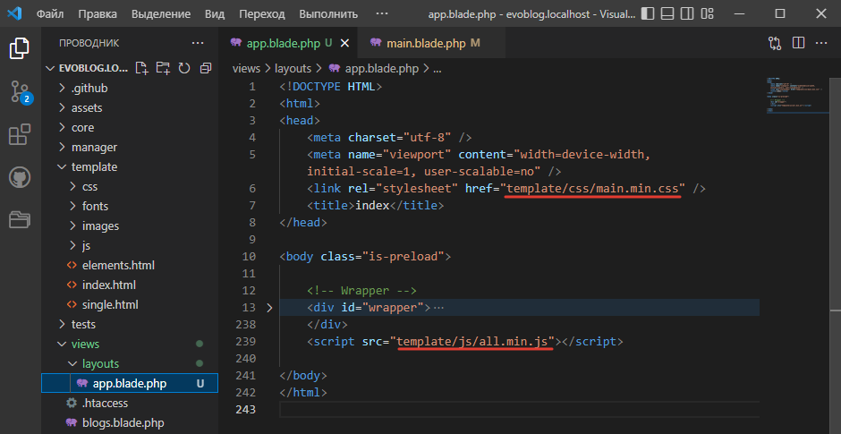
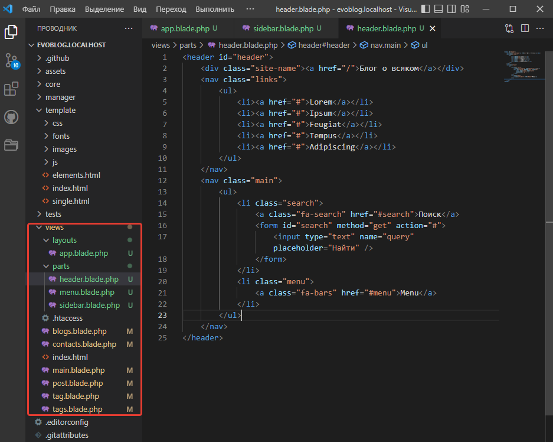
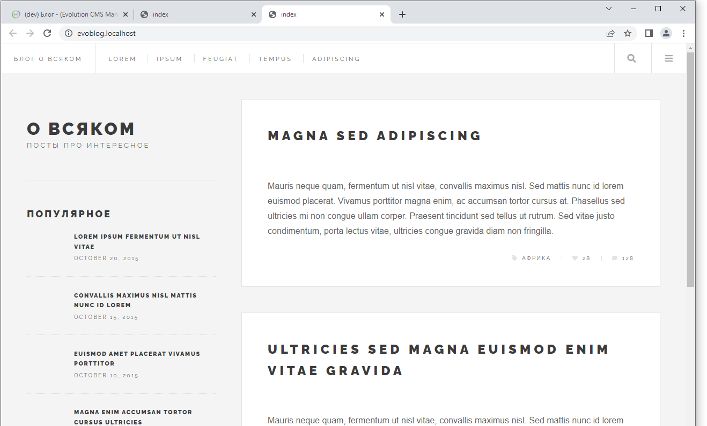
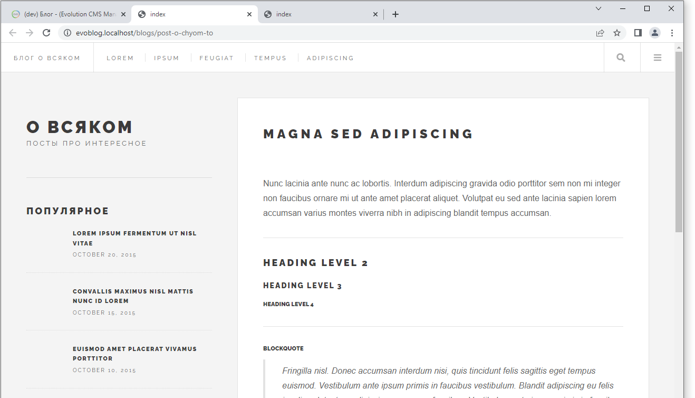

# Шаблон блога. Интеграция дизайна в Evolution CMS

Сейчас будет сложновато и долго, но оно того стоит.

Оглавление
* [Про будущий дизайн](#part1)
* [Копируем дизайн](#part2)
* [Связь псевдонима и файла шаблона](#part3)
* [Проверка](#part4)
* [Blade](#part5)
* [Шаблоны. Базовый шаблон](#part6)
* [Шаблоны. Наследуем шаблоны](#part7)
* [Шаблоны. Выносим части шаблона в отдельные файлы](#part8)
* [Шаблоны. Секции содержимого](#part9)

## Про будущий дизайн <a name="part1"></a>

Для начала скачайте html-шаблон. Репозиторий лежит на 
[моём гитхабе](https://github.com/0test/future-imperfect-layout).

Жмите `Code -> Download ZIP`, либо клонируйте к себе, если умеете работать с git.

Шаблон будет дорабатываться исходя из потребностей и дальнейших уроков. На данный момент там есть три страницы:
* index.html - главная,
* single.html - страница поста,
* elements.html - набор разных элементов.

**Что это за app, dist, package?**

Не обращайте внимания ни на что, кроме папки `dist`. Именно там хранится привычный html-код шаблона.

>Остальные файлы и папки я сделал для облегчения вёрстки при помощи gulp. Если вам знаком этот термин, то в папке app вы можете найти исходные файлы, отредактировать шаблон и скомпилировать его под себя.

Так что открывайте index.html и смотрите, что мы будет делать.


## Копируем дизайн <a name="part2"></a>

В Evolution CMS нет строгого требования к папке, где должны быть размещены изображения, js и css файлы шаблона.

Создайте папку `template` в корне сайта, и скопируйте туда всё содержимое папки `dist` из репозитория.


Файлы *.html можно не копировать, они ни на что не влияют. Просто в дальнейшем так удобнее таскать оттуда кусочки кода.

## Вспоминаем про шаблоны

На [четвёртом занятии](/004_%D0%A1%D1%82%D1%80%D1%83%D0%BA%D1%82%D1%83%D1%80%D0%B0%20%D1%81%D0%B0%D0%B9%D1%82%D0%B0%20%D0%B8%20%D1%88%D0%B0%D0%B1%D0%BB%D0%BE%D0%BD%D1%8B.md) мы делали шаблоны в админ-панели.
Мы даже использовали их, создавая структуру сайта.

Давайте вспомним, что мы создали, но теперь обратите внимание на поле "Псевдоним".


| Имя				|    Псевдоним      |  Описание  	|
|-------------------|:-----------------:|--------------:|
| Главная страница	|	main			| Для главной 	|
| Все блоги 		|	blogs   		| Лента блогов	|
| Пост в блоге		|	post   			| Пост в блоге	|
| Контакты 			|	contacts 		| Контакты		|
| Все теги 			|	tags 			| Лента тегов 	|
| Тег 				|	tag 			| Страница тега 	|

В тот момент он был нам не важен. Теперь настало время его использовать.

## Связь псевдонима и файла шаблона <a name="part3"></a>

Откройте папку `views` в корне сайта.


Что-то знакомое - blogs, post, contacts.

Evolution CMS сама сделала пустые файлы шаблонов, соответствующие тем псевдонимам, что мы задавали в админ-панели.
Разве что к псевдониму добавилось окончание `.blade.php`.

> Если вы не забыли нажать чекбокс "Создать файл шаблона при сохранении", разумеется. Если же забыли -  можно создать его руками.

Резюмируем:

**Шаблон в папке views связан с шаблоном в админ-панели через поле псевдоним**

## Проверка <a name="part4"></a>

Давайте проверим, что наши шаблоны работают?

Откройте файл `main.blade.php`и напишите там слово "главная". Сохраните и перейдите на главную страницу вашего сайта.


Попробуйте сделать то же самое с другими файлами.
Если какой-то из шаблонов не работает, проверьте внимательно псевдоним и имя файла. Они должны быть одинаковы.

## Про Blade <a name="part5"></a>

 В Evolution CMS используется шаблонизатор Blade, и это не так страшно выглядит, как называется. 
 Он позаимствован Evolution CMS из Laravel. Привыкнув работать с Blade здесь, вам будет гораздо легче освоиться с Blade в Laravel или, скажем, с Twig в Drupal.

 **Зачем шаблонизатор?**

Если заглянуть в дизайн и представить этот сайт с сотней постов, вы увидите, что есть элементы, которые будут всегда неизменны - шапка, логотип. А есть области, где на разных страницах будет разный контент - заголовок, текст, фото.


Именно этим и занят шаблонизатор. Мы задаём некий "шаблон", размечаем его и определяем, в какой области что показывать.


Я примерно показал на скрине, где будут изменяемые области: тайтл, сайдбар, заголовок и текст поста.


## Шаблоны. Базовый шаблон. <a name="part6"></a>

Внимательно изучите верстку будущего блога.
Выделите для себя, какие части повторяются в index.html и в single.html, какие неизменны. Где находится сайдбар? Где меню? Какие блоки в сайдбаре как называются?

Очень скоро вы поймёте, что было бы логичным создать некий базовый шаблон, который  включет в себя только неизменные части дизайна.

А главная страница и страница поста будут "дочерними" шаблонами от этой базы.
Таким образом, захоти мы изменить шапку, мы поменяем её одним махом на всех шаблонах.

Давайте сделаем базовый шаблон.

Создайте папку `layouts` внутри `/views`. Это общепринятое название, вы, разумеется, можете назвать её так, как желаете.
Внутри создайте файл `app.blade.php`. Этот файл и будет нашим базовым шаблоном для всех страниц.

Теперь копируйте содержимое `index.php` в  `app.blade.php`.

В шаблоне есть подключаемые файлы js и css. Исправьте пути на верные:
```html
<link rel="stylesheet" href="template/css/main.min.css" />
```

```html
<script src="template/js/all.min.js"></script>
```

Базовый шаблон на этом этапе больше не будем трогать, но обязательно к нему вернёмся.



>Секция wrapper свернута для удобства - там код.

## Шаблоны. Наследуем шаблоны. <a name="part7"></a>

Теперь мы хотим, чтобы все наши остальные шаблоны зависели от базового.

Зависимость создаётся директивой `@extends('путь.шаблон')`.

Откройте `/views/main.blade.php` и впишите туда следующее:
```
@extends('layouts.app')
```
В блейде действует так называемая "точечная" нотация. Если быть проще, то вместо слешей - точки. 
Так мы получаем конструкцию, которая говорит `"наследуй из папки layouts файл app"`.

**Точки вместо слешей, .blade.php не пишем**

Повторите эту процедуру для всех шаблонов внутри папки `/views`.

> файл index.html внутри - служебный, его не трогайте

Сохраните файлы и "погуляйте" по сайту при помощи кнопки "Просмотр".

Скажем, попробуйте посмотреть, как выглядит страница контакты и страница поста в блоге.

Если с контактами всё хорошо, то в блоге у вас "слетит" вёрстка. В чём дело? 
Обычный html и особенность путей. Мы указали пути к css и js без слешей.

Давайте чуток исправим `app` файл.
Впишите в `<head>`:

```html
<base href="{{ $modx->getConfig('site_url') }}">
```


Что мы сделали? Определили базовый путь и присвоили ему значение из конфигурации сайта.

**Запоминаем эту конструкцию. Она нужна для того, чтобы вывести из конфигурации сайта значение**

Загляните в исходный код. После обработки сайт вернёт следующее:
```html
<base href="http://evoblog.localhost/">
```

При желании поправьте пути изображений. Но это не критично.
```
из
images/pic02.jpg 
в
template/images/pic02.jpg
```

Теперь все страницы должны открываться корректно и без ошибок.

## Шаблоны. Выносим части шаблона в отдельные файлы <a name="part8"></a>

Давайте унесём некторые части шаблона в отдельные файлы. 

Да, в этом дизайне подобное действие неоправдано - он слишком прост. Однако на живом большом сайте вам будет удобно, если структура шаблонов будет более предсказуема и вариативна.

Создайте папку `parts` внутри `views`. Сюда будем засовывать части шаблонов.

Найдите в `app` тег `header` и уберите его со всем содержимым .

Вместо этого напишите там:
```
@include('parts.header')
```
И создайте внутри `parts` файл `header.blade.php`. В него вставьте содержимое вырезанного `header`.

Проделайте ту же работу с `menu` и `sidebar`.

**Запоминаем: директива `@include` вставляет содержимое файла в указанное место шаблона**

Что у вас должно получиться в `app.blade.php`:

```html
<!DOCTYPE HTML>
<html>
<head>
    <meta charset="utf-8" />
    <base href="{{ $modx->getConfig('site_url') }}">
    <meta name="viewport" content="width=device-width, initial-scale=1, user-scalable=no" />
    <link rel="stylesheet" href="template/css/main.min.css" />
    <title>index</title>
</head>

<body class="is-preload">
    <div id="wrapper">
        @include('parts.header')
        <!-- Menu -->
        @include('parts.menu')
        <!-- Main -->
        <main id="main">
            <!-- Post -->
            <article class="post">
                <header>
                    <div class="title">
                        <h1><a href="single.html">Magna sed adipiscing</a></h1>
                        <a href="single.html" class="image featured"></a>
                    </div>
                </header>
                <p>Mauris neque quam, fermentum ut nisl vitae, convallis maximus nisl. Sed mattis nunc id lorem euismod
                    placerat. Vivamus porttitor magna enim, ac accumsan tortor cursus at. Phasellus sed ultricies mi non
                    congue ullam corper. Praesent tincidunt
                    sed tellus ut rutrum. Sed vitae justo condimentum, porta lectus vitae, ultricies congue gravida diam
                    non fringilla.</p>
                <footer>
                    <ul class="stats">
                        <li><a href="/tags/afrika" class="icon solid fa-tag">Африка</a></li>

                        <li><a href="#" class="icon solid fa-heart">28</a></li>
                        <li><a href="#" class="icon solid fa-comment">128</a></li>
                    </ul>
                </footer>
            </article>
            <!-- Pagination -->
            <ul class="actions special pagination">
                <li><a href="" class="disabled button  previous">&laquo;</a></li>
                <li><a href="#" class="button ">1</a></li>
                <li class=" is-active">2</li>
                <li>...</li>

                <li><a href="#" class="button ">10</a></li>

                <li><a href="#" class="button  next">&raquo;</a></li>
            </ul>

        </main>
        @include('parts.sidebar')
    </div>
    <script src="template/js/all.min.js"></script>
</body>
</html>

```

А вот так выглядит папка `views`




## Шаблоны. Секции содержимого <a name="part9"></a>

 Даже в нашем дизайне, где страница поста не очень отличается от главной, различия есть. Обратите внимание на секцию `main`, где расположен пост/посты. На главной странице это лента всех постов, на странице поста - один пост. У них чуть-чуть отличается разметка, скажем, заголовок h2 заменяется на h1, внутри теги section и т.д.


Как же вывести в разных шаблонах разное содержимое? Вынести это в переменную. Давайте определим, с какого места в шаблоне начинаются различия.

Всё содержимое, включая тег `<main id="main">` одинаково.
Идём в базовый шаблон и вырезаем всё.

Получается вот так:
```html
<!DOCTYPE HTML>
<html>
<head>
    <meta charset="utf-8" />
    <base href="{{ $modx->getConfig('site_url') }}">
    <meta name="viewport" content="width=device-width, initial-scale=1, user-scalable=no" />
    <link rel="stylesheet" href="template/css/main.min.css" />
    <title>index</title>
</head>

<body class="is-preload">
    <div id="wrapper">
        @include('parts.header')
        @include('parts.menu')
        <main id="main">
            <!-- тут изменяемый контент -->
        </main>
        @include('parts.sidebar')
    </div>
    <script src="template/js/all.min.js"></script>
</body>
</html>

```

Теперь внутри `<main>` нужно определить изменяемую секцию, которую смогут поменять дочерние шаблоны. Пишем:

```
@yield('content')
```
Директива `@yield` выведет содержимое секции `content`.

Ближайшая аналогия - мы как будто бы сейчас написали вывод переменной content в определённое место.

Если сейчас открыть сайт, то в `<main></main>` будет пусто.

Давайте зададим эту переменную?

Откройте файл `main.blade.php` и измените его:

```
@extends('layouts.app')

@section('content')
я контент	
@endsection
```

**Запомнить: директива @section задаёт содержимое секции, которое потом можно вывести при помощи @yield**


Ну и вместо "я контент" теперь мы можем спокойно скопировать туда содержимое главной - ленту постов и разметку пагинации.

```html
@extends('layouts.app')

@section('content')
    <!-- Post -->
    <article class="post">
        <header>
            <div class="title">
                <h1><a href="single.html">Magna sed adipiscing</a></h1>
                <a href="single.html" class="image featured"></a>
            </div>
        </header>
        <p>text</p>
        <footer>
            <ul class="stats">
                <li><a href="/tags/afrika" class="icon solid fa-tag">Африка</a></li>

                <li><a href="#" class="icon solid fa-heart">28</a></li>
                <li><a href="#" class="icon solid fa-comment">128</a></li>
            </ul>
        </footer>
    </article>

     <!-- повторите цать раз элемент class="post", если хотите  -->

    <!-- Pagination -->
    <ul class="actions special pagination">
        <li><a href="" class="disabled button  previous">&laquo;</a></li>
        <li><a href="#" class="button ">1</a></li>
        <li class=" is-active">2</li>
        <li>...</li>

        <li><a href="#" class="button ">10</a></li>

        <li><a href="#" class="button  next">&raquo;</a></li>
    </ul>
@endsection

```


Отлично. Теперь нас интересует страница конкретного поста.
Найдём его шаблон `post.blade.php` и изменим таким же образом. Только внутрь секции мы копируем уже разметку поста из файла single.html

```html
@extends('layouts.app')

@section('content')
    <article class="post">
        <header>
            <div class="title">
                <h1>Magna sed adipiscing</h1>
                <div class="image featured">
                    
                </div>
            </div>
        </header>
        <section>
			<!-- тут куча текста, для экономии места не буду копировать -->
        </section>
        </section>
        <footer>
            <ul class="stats">
                <li><a href="/tags/afrika" class="icon solid fa-tag">Африка</a></li>
                <li><a href="/tags/afrika" class="icon solid fa-tag">Африка</a></li>

                <li><a href="#" class="icon solid fa-heart">28</a></li>
                <li><a href="#" class="icon solid fa-comment">128</a></li>
            </ul>
        </footer>
    </article>
@endsection
```

Проверьте себя. Главная страница должна содержать верстку всех постов:



А страница поста - только разметку поста:




Сделайте нечто похожее для оставшихся шаблонов.

Скажем, шаблон "Блоги" будет 1 в 1 как шаблон главной - лента постов и пагинация. Такой же будет и шаблон одного тега -- там будет выведена лента постов по тегу.

Общая страница "Теги" @TODO #1

Страницу "Контакты" сделайте такую же, как шаблон поста, просто убрав лишнее типа footer'а и картинок.

> А можете открыть файл `elements.html` и собрать из элементов нужный дизайн.


**Итого**
* Знаем про связь псевдонима и файла шаблона
* Запомнили папку `views`.
* поняли, как работает наследование от базового шаблона
* запомнили пару директив для шаблонов - section, yield, extend
* увидели первую команду `$modx->getConfig()`
* сайт начинает приобретать внешний вид: пост/посты, главная, контакты
* на сайте не выводится содержимое из админки


Теперь настало время оживить сайт и [выводить в шаблонах настоящее содержимое](/007_%D0%92%D1%8B%D0%B2%D0%BE%D0%B4%D0%B8%D0%BC%20%D0%BA%D0%BE%D0%BD%D1%82%D0%B5%D0%BD%D1%82%20%D0%B2%20%D1%88%D0%B0%D0%B1%D0%BB%D0%BE%D0%BD%D0%B5.%20%D0%9A%D0%BE%D0%BD%D1%82%D1%80%D0%BE%D0%BB%D0%BB%D0%B5%D1%80%D1%8B.%20%D0%9F%D0%B0%D0%BA%D0%B5%D1%82%20main.md).