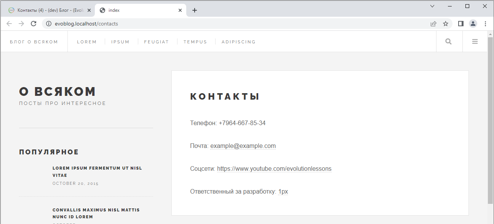
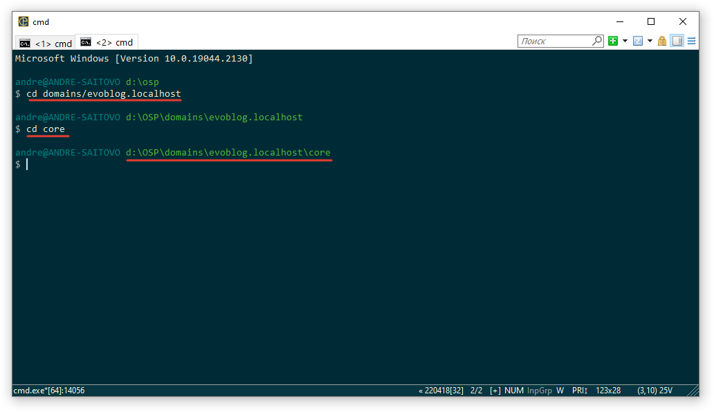

# Выводим контент в шаблоне. Контроллеры. Пакет main.


Оглавление
* [Переменные и директивы в шаблонах](#part1)
* [Выводим содержимое документа](#part2)
* [Контроллеры](#part3)
* [Базовый контроллер](#part4)
* [Наследование, контроллер шаблона](#part5)
* [Отладка и Tracy](#part6)


## Переменные и директивы в шаблонах <a name="part1"></a>

Шаблоны готовы, теперь нужно выводить информацию.

>Предварительно создайте десяток постов в блоге и заполните все поля, кроме тегов. В поле "аннотация" вставьте краткое содержание поста. 

Шаблоны Blade содержат HTML-теги и директивы Blade, которые позволяют выводить значения, использовать оператор "if-else", выполнять итерацию данных в цикле и многое другое.

### Переменные
Вы можете отобразить содержимое переменной name следующим образом:
```php
Hello, {{ $name }}.
```

### Экранирование

Выражения {{ }} автоматически обрабатываются функцией htmlspecialchars для предотвращения XSS-атак. Если вы не хотите, чтобы ваши данные были экранированы, вы можете использовать следующий синтаксис:

```php
Hello, {!! $name !!}.
```

В Evolution CMS вам доступны системные переменные:

```php
$modx

$documentObject
```
Можно получить доступ к различным объектам, предоставляемым системой:

```php
{!! $modx->getConfig('site_name) !!}
```

Или получить любое поле ресурса:

```php
{!! $documentObject['content'] !!}
```

## Выводим содержимое документа <a name="part2"></a>

Теперь, когда вы знаете чуть больше о шаблонизаторе, давайте сделаем полноценный шаблон для поста в блоге.

Откройте файл `post.blade.php` и отредактируйте секции примерно таким образом:
```html
        <header>
            <div class="title">
                <h1>{{ $documentObject['pagetitle'] }}</h1>
                <div class="image featured">
                    
                </div>
            </div>
        </header>
        <section>
            {!! $documentObject['content'] !!}
        </section>
```

Мы используем массив `$documentObject` и в скобках указываем машинное имя поля, которое хотим вывести. ТВ-параметр - это тоже поле. 

> Обратите внимание,  content выводится с другим синтаксисом. Там точно будут html-теги, и именно поэтому мы отключаем экранирование.

Где найти машинное наименование поля? В документации, в отладчике Trace(позже) или же просто проинспектировать документ:


Таким образом, если мы захотим вывести аннотацию, то напишем 

```php
{{ $documentObject['introtext'] }}
```

А если мы вдруг захотим вывести что-то из системной конфигурации, скажем, имя сайта, то следует воспользоваться другим массивом.

```php
{{ $modx->getConfig('site_name') }}
```

Откуда взялось `site_name` и что ещё можно вывести, вы, наверное, уже догадались. Если нет, подсказка в уроке номер три.

### Запоминаем: ###
**Для документа `$documentObject`**
**Для конфигурации `$modx->getConfig`**

Теперь мы можем спокойно выводить информацию на страницу блога или на страницу контакты.

С блогом справились, давайте сделаем контакты `contacts.blade.php`:

```html
@extends('layouts.app')

@section('content')
    <article class="post">
        <header>
            <div class="title">
                <h1>{{ $documentObject['pagetitle']}}</h1>
            </div>
        </header>
        <section>
            {!! $documentObject['content'] !!}
        </section>
    </article>
@endsection
```

Заполните "контакты" в админке, откройте и проверьте:



Итак, мы научились выводить содержимое одиночных страниц.

А как быть, если на главной странице, в сайдбаре или в блоге нужно вывести ленту всех материалов? Откуда взять данные для постов и пагинации, раз в documentObject только документ? 

## Контроллеры	<a name="part3"></a>

Сначала немного общей информации.

### Определение  
Контроллер - это класс, который обрабатывает входящие запросы и отдаёт данные в представление. Что такое представление? Для нас - всё, что лежит в папке `views`.

Связь осуществляется через поле *шаблона* `псевдоним`. Да, опять оно. Важное поле в Evolution CMS.

### Примеры
Для шаблона с псевдонимом `main` соответствующее название контроллера `MainController.php`

Для шаблона с псевдонимом `news_main` соответствующее название контроллера `NewsMainController.php`

Символ подчёркивания вырезается. В псевдониме используйте только буквы и подчёркивание.

### Пакет Main

Для того, чтобы полноценно работать с контроллерами в Evolution CMS, нужно совершить несколько действий.
Для начала мы открываем консоль OpenServer'а и переходим в папку сайта. Дальше идём в папку `core`.


Теперь обновим существующие пакеты, чтобы не было ошибок

```shell
composer update
```
Операция длительная - менеджер зависимостей composer проверяет, что у нас установлено и при необходимости скачивает и обновляет пакеты и их зависимости.

Теперь нам необходимо создать некий "стартовый" пакет, где мы будем писать контроллеры.
Как правило, этот пакет называют `main`.
Вводите команду

```shell
php artisan package:create main
```


Перейдите в папку `/core/custom/packages/`. Внутри неё вы должны увидеть папку `main` с разными вложенными папками. Все они не особо интересуют нас на данном этапе за исключением папки `/core/custom/packages/main/src/Controllers`.

Именно здесь будут расположены контроллеры. В дальнейшем я буду говорить о папке `Controllers` как о папке внутри пакета `main`, чтобы не писать каждый раз полный путь. 


## Базовый контроллер <a name="part4"></a>

Особенность работы с контроллерами в Evolution CMS такова, что нужно создать `BaseController`. Некий базовый контроллер "для всего".

Он будет использоваться по-умолчанию, если мы забыли/не захотели указать контроллер для определённого шаблона.

Давайте пока что сделаем его пустым, как некую "заглушку".
```php

<?php 
namespace EvolutionCMS\Main\Controllers;
class BaseController{
	public function __construct(){

	}
}
```
Вот и всё. В дальнейшем мы к нему вернёмся и добавим чуток удобства для остальных контроллеров.

Теперь нужно сделать контроллеры для шаблонов.


## Наследование, контроллер шаблона <a name="part5"></a>

Как и в Laravel, имеет смысл в некоторых ситуациях 

### Главная страница

Давайте сделаем ленту постов на главной странице.

Амбула: в шаблонах откуда-то надо брать данные и это "откуда-то" как раз и есть связь шаблона и контроллера.

Вспоминаем псевдонимы.

| Имя				|    Псевдоним      |  Описание  	|
|-------------------|:-----------------:|--------------:|
| Главная страница	|	main			| Для главной 	|
| Все блоги 		|	blogs   		| Лента блогов	|
| Пост в блоге		|	post   			| Пост в блоге	|
| Контакты 			|	contacts 		| Контакты		|
| Все теги 			|	tags 			| Лента тегов 	|
| Тег 				|	tag 			| Страница тега |

У шаблона главной страницы псевдоним `main`.
Значит создаём файл `MainController.php`

```php
<?php
namespace EvolutionCMS\Main\Controllers;
class MainController{
	public function __construct(){

		dd('main');
	}


}
```

## Отладка и Tracy <a name="part6"></a>
	* Покажем в Tracy, что доступно по умолчанию.