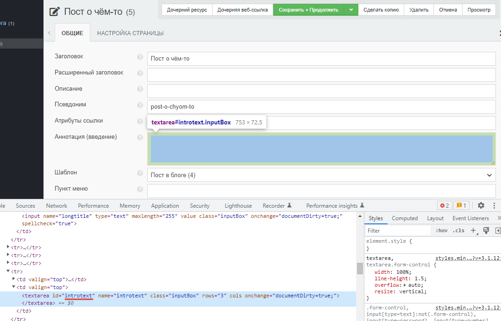
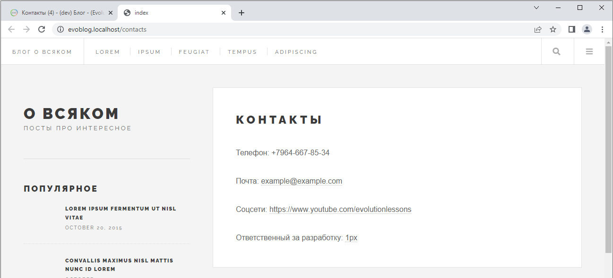

# Выводим контент в шаблоне


Оглавление
* [Переменные и директивы в шаблонах](#part1)
* [Выводим содержимое документа](#part2)


## Переменные и директивы в шаблонах <a name="part1"></a>

Шаблоны готовы, теперь нужно выводить информацию.

>Предварительно создайте десяток постов в блоге и заполните все поля, кроме тегов. В поле "аннотация" вставьте краткое содержание поста. 

Шаблоны Blade содержат HTML-теги и директивы Blade, которые позволяют выводить значения, использовать оператор "if-else", выполнять итерацию данных в цикле и многое другое.

### Переменные
Вы можете отобразить содержимое переменной name следующим образом:
```php
Hello, {{ $name }}.
```

### Экранирование

Выражения {{ }} автоматически обрабатываются функцией htmlspecialchars для предотвращения XSS-атак. Если вы не хотите, чтобы ваши данные были экранированы, вы можете использовать следующий синтаксис:

```php
Hello, {!! $name !!}.
```

В Evolution CMS вам доступны системные переменные:

```php
$modx

$documentObject
```
Можно получить доступ к различным объектам, предоставляемым системой:

```php
{!! $modx->getConfig('site_name) !!}
```

Или получить любое поле ресурса:

```php
{!! $documentObject['content'] !!}
```

## Выводим содержимое документа <a name="part2"></a>

Теперь, когда вы знаете чуть больше о шаблонизаторе, давайте сделаем полноценный шаблон для поста в блоге.

Откройте файл `post.blade.php` и отредактируйте секции примерно таким образом:
```html
        <header>
            <div class="title">
                <h1>{{ $documentObject['pagetitle'] }}</h1>
                <div class="image featured">
                    
                </div>
            </div>
        </header>
        <section>
            {!! $documentObject['content'] !!}
        </section>
```

Мы используем массив `$documentObject` и в скобках указываем машинное имя поля, которое хотим вывести. ТВ-параметр - это тоже поле. 

> Обратите внимание,  content выводится с другим синтаксисом. Там точно будут html-теги, и именно поэтому мы отключаем экранирование.

Где найти машинное наименование поля? В документации, в отладчике Trace(позже) или же просто проинспектировать документ:



Таким образом, если мы захотим вывести аннотацию, то напишем 

```php
{{ $documentObject['introtext'] }}
```

А если мы вдруг захотим вывести что-то из системной конфигурации, скажем, имя сайта, то следует воспользоваться другим массивом.

```php
{{ $modx->getConfig('site_name') }}
```

Откуда взялось `site_name` и что ещё можно вывести, вы, наверное, уже догадались. Если нет, подсказка в уроке номер три.

Запоминаем:

>Для документа `$documentObject`
Для конфигурации `$modx->getConfig`

Теперь мы можем спокойно выводить информацию на страницу блога или на страницу контакты.

С блогом справились, давайте сделаем контакты `contacts.blade.php`:

```html
@extends('layouts.app')

@section('content')
    <article class="post">
        <header>
            <div class="title">
                <h1>{{ $documentObject['pagetitle']}}</h1>
            </div>
        </header>
        <section>
            {!! $documentObject['content'] !!}
        </section>
    </article>
@endsection
```

Заполните "контакты" в админке, откройте и проверьте:



Итак, мы научились выводить содержимое одиночных страниц.

А как быть, если на главной странице, в сайдбаре или в блоге нужно вывести ленту всех материалов? Откуда взять данные для постов и пагинации, раз в documentObject только документ? 
