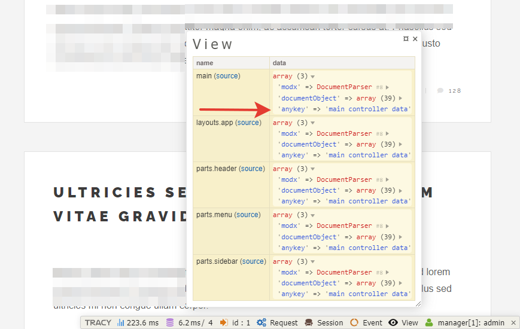

# Контроллеры. Пакет main. Выводим анонсы записей в блоге, делаем пагинацию

* [Контроллеры](#part3)
* [Базовый контроллер](#part4)
* [Отладка и Tracy](#part5)
* [Контроллер шаблона](#part6)
* [Наследование](#part7)


## Контроллеры	<a name="part3"></a>

Сначала немного общей информации.

### Определение  
Контроллер - это класс, который обрабатывает входящие запросы и отдаёт данные в представление. Что такое представление? Для нас - всё, что лежит в папке `views`.

Связь осуществляется через поле *шаблона* `псевдоним`. Да, опять оно. Важное поле в Evolution CMS.

### Примеры
Для шаблона с псевдонимом `main` соответствующее название контроллера `MainController.php`

Для шаблона с псевдонимом `news_main` соответствующее название контроллера `NewsMainController.php`

Символ подчёркивания вырезается. В псевдониме используйте только буквы и подчёркивание.

### Пакет Main

Для того, чтобы полноценно работать с контроллерами в Evolution CMS, нужно совершить несколько действий.
Для начала мы открываем консоль OpenServer'а и переходим в папку сайта. Дальше идём в папку `core`.


Теперь обновим существующие пакеты, чтобы не было ошибок

```shell
composer update
```
Операция длительная - менеджер зависимостей composer проверяет, что у нас установлено и при необходимости скачивает и обновляет пакеты и их зависимости.

Теперь нам необходимо создать некий "стартовый" пакет, где мы будем писать контроллеры.
Как правило, этот пакет называют `main`.
Вводите команду

```shell
php artisan package:create main
```


Перейдите в папку `/core/custom/packages/`. Внутри неё вы должны увидеть папку `main` с разными вложенными папками. На данном этапе все они нас не особо интересуют, кроме папки `/core/custom/packages/main/src/Controllers`.

Именно здесь будут расположены контроллеры. В дальнейшем я буду говорить о папке `Controllers` как о папке внутри пакета `main`, чтобы не писать каждый раз полный путь. 


## Базовый контроллер <a name="part4"></a>

Особенность работы с контроллерами в Evolution CMS такова, что нужно создать `BaseController` - некий базовый контроллер "для всего".

Он будет использоваться по умолчанию, если вы забыли/не захотели указать контроллер для определённого шаблона.

Давайте пока что сделаем его пустым, как некую "заглушку". Создайте файл `Controllers/BaseController.php`:

```php
<?php
namespace EvolutionCMS\Main\Controllers;
class BaseController{
	public function __construct(){

	}
}
```
Вот и всё. В дальнейшем мы к нему вернёмся и добавим чуток удобства для остальных контроллеров.

Теперь нужно сделать контроллеры для шаблонов.


## Отладка и Tracy <a name="part5"></a>

Чтобы нам было проще отлаживать контроллеры, давайте включим Tracy. Это удобная панель для отображения различных данных страницы.

Создайте папку
```
core/custom/config/tracy/
```
Создайте файл `active.php`

```php
<?php 

return 'adminfrontonly';
```


## Контроллер шаблона <a name="part6"></a>

### Главная страница

Давайте сделаем ленту постов на главной странице.

Амбула: в шаблонах откуда-то надо брать данные и это "откуда-то" как раз и есть связь шаблона и контроллера.

Вспоминаем псевдонимы.

| Имя				|    Псевдоним      |  Описание  	|
|-------------------|:-----------------:|--------------:|
| Главная страница	|	main			| Для главной 	|
| Все блоги 		|	blogs   		| Лента блогов	|
| Пост в блоге		|	post   			| Пост в блоге	|
| Контакты 			|	contacts 		| Контакты		|
| Все теги 			|	tags 			| Лента тегов 	|
| Тег 				|	tag 			| Страница тега |

У шаблона главной страницы псевдоним `main`.
Значит, создаём файл `Controllers/MainController.php`:

```php
<?php
namespace EvolutionCMS\Main\Controllers;
class MainController{
    public function __construct(){
        dd('main');
    }
}
```

> Функция `dd()` означает dump & die - выведи и умри, если буквально. Она выводит любые переменные и объекты на печать.

Откройте главную страницу сайта, там должно быть напечатано слово `main`.


Что может пойти не так: неверное имя контроллера, неверное местоположение файла, неверное название класса. 

### Как отдать данные во view?

В  любом контроллере доступен объект `EvolutionCMS()`. Среди прочих там имеется метод `addDataToView`, который как раз отдаёт данные в шаблон.

Пишем:
```php
<?php
namespace EvolutionCMS\Main\Controllers;
class MainController{
    public $data = [];
    public $evo;
    public function __construct(){
        $this->evo = EvolutionCMS();
        $this->render();
        $this->sendToView();
    }
    public function render()
    {
        $this->data['anykey'] = 'main controller data';
    }
    public function sendToView()
    {
        $this->evo->addDataToView($this->data);
    }
}
```

**Что происходит?**

Сделана переменная `$data`, где мы будем хранить нужные нам данные.

* Метод `sendToView` отдаёт данные `$data` в шаблон.
* Метод `render` для присваивания данных. Просто, чтобы не писать "простыни" в `__construct`.
* Там мы добавили переменной `$data` ключ `anykey` и текстовое значение для теста.
* В методе `__construct` (который выполняется по умолчанию) мы присваиваем переменной `$evo` значение `EvolutionCMS()`, чтобы достучаться до системных функций. 
* Дальше вызываем по очереди оба метода, чтобы присвоить значения и отдать их в шаблон.

Откройте главную страницу и обратите внимание на нижнюю часть.

Во вкладке `View` можете увидеть данные, которые в нашем распоряжении. В частности, свежесозданный ключ `anykey` и его значение.



Можете зайти в шаблон главной страницы и для теста вывести значение.
```
{{ $anykey }}
```


### Используем DocLister

Для выборки ресурсов есть много способов, но самый простой на данном этапе - использование сниппета DocLister. Мы установили его ранее. Так что теперь просто воспользуемся им в контроллере при помощи метода Evolution CMS `runSnippet`.

>Сниппет - кусок самостоятельного кода, который реализует любой функционал, доступный php. 
Может быть как написан вами, так и скачан в рамках готовых дополнений (ex DocLister).

Подробности про сниппеты вы можете найти в документации. Пока достаточно знать, что DocLister специализируется как раз на выборке различных лент материалов, фильтрации и обработке.

> Метод runSnippet запускает сниппет из php.

Давайте применим эти знания для выбора постов.
```php

<?php
namespace EvolutionCMS\Main\Controllers;
class MainController{
	public $data = [];
	public $evo;
	public function __construct(){
        $this->evo = EvolutionCMS();
        $this->render();
        $this->sendToView();
	}
    public function render()
    {
        $result = $this->evo->runSnippet('DocLister',[
            'parents' => 2,
            'depth' => 1,
            'tvPrefix' => '',
            'tvList' => 'post_mainphoto',
            'display' => 10,
            'returnDLObject' => 1,
        ]);
        $this->data['posts'] = $result->getDocs();
        return $this->data['posts'] ;
    }
    public function sendToView()
    {
        $this->evo->addDataToView($this->data);
    }
}
```

Доклистеру переданы параметры, самый важный из которых `returnDLObject` - просьба вернуть объект, а не отдавать сразу результаты. В противном случае мы получили бы свёрстанный html. Параметр `parents` указывает, откуда выбирать посты. Параметр `depth` - глубину выборки, а `display` количестов постов.

Параметры `tvList` и `tvPrefix` относятся к выбору ТВ-параметров - по умолчанию Доклистер не выбирает ТВ документа, чтобы сэкономить на mysql-запросах. Так что все нужные ТВ необходимо перечислить в `tvList`.

Итак, у нас есть переменная `posts`, в которой массив выбранных документов. Теперь мы можем оперировать данными в шаблоне.

**Цикл foreach**

Заходим в шаблон главной страницы и правим его:

```html
@extends('layouts.app')
@section('content')
    @foreach ($posts as $post)
    <article class="post">
        <header>
            <div class="title">
                <h1><a href="{{ urlProcessor::makeUrl($post['id'] ) }}">{{ $post['pagetitle'] }}</a></h1>
                <a href="{{ urlProcessor::makeUrl($post['id'] ) }}" class="image featured">
                    
                </a>
            </div>
        </header>
        {{ $post['introtext'] }}
        <footer>
            <ul class="stats">
                <li><a href="/tags/afrika" class="icon solid fa-tag">Африка</a></li>
                <li><a href="#" class="icon solid fa-heart">28</a></li>
                <li><a href="#" class="icon solid fa-comment">128</a></li>
            </ul>
        </footer>
    </article>
    @endforeach
@endsection

```

Обратите внимание на `@foreach` - это цикл по массиву постов `$posts` , которые мы отдали в шаблон. Внутри цикла мы просто получаем доступ к значениям внутри каждого поста и выводим их в нужных местах.

Внимания заслуживает и конструкция `{{ urlProcessor::makeUrl($post['id'] ) }}` - это директива EvolutionCMS. Служит для создания ссылки на документ. В неё мы просто передали id поста.

Запомним 
> `{{ urlProcessor::makeUrl( идентификатор ) }}` сделает нам ссылку

Таким образом, вы должны увидеть на главной странице сверстанный список всех постов.
Секцию footer поправим позже, пусть остаётся пока что статичной.


## Наследование	контроллера <a name="part7"></a>


### Контроллер страницы блогов

На главной странице нас всё устраивает. А вот для страницы "Блоги" нужна пагинация,ведь когда постов будут сотни, нельзя их показывать на одной странице.


Делаем контроллер для шаблона "Все блоги". Его псевдоним `blogs`, значит файл будет называться `BlogsController.php`.

**Наследование. Давайте рассуждать**

В контроллере блогов `BlogsController` методы из контроллера главной страницы  `MainController` повторяются. Повторяются переменные, логика. Вызов методов абсолютно такой же.
А что, если нам вынести все нужные методы в базовый класс, унаследовать его и потом спокойно пользоваться в контроллерах шаблона?

А что, если нам понадобится отдать какие-то данные сразу всем шаблонам? А что, если что-то ещё?


**Наследование. Давайте делать**


Открываем `BaseController` и изменяем его:
```php
<?php 
namespace EvolutionCMS\Main\Controllers;
class BaseController{
    public $data = [];
    public $evo;
    public function __construct(){
        $this->evo = EvolutionCMS();
        $this->render();
        $this->sendToView();
    }
    public function render()
    {
    }
    public function sendToView()
    {
        $this->evo->addDataToView($this->data);
    }
}
```
А в MainController и BlogsController наследуем и убираем ненужное.
```php 
<?php
namespace EvolutionCMS\Main\Controllers;
class MainController extends BaseController{
    public function render()
    {
        $result = $this->evo->runSnippet('DocLister',[
            'parents' => 2,
            'depth' => 1,
            'tvPrefix' => '',
            'tvList' => 'post_mainphoto',
            'display' => 10,
            'returnDLObject' => 1,
        ]);
        $this->data['posts'] = $result->getDocs();
        return $this->data['posts'] ;
    }
}
```
Обратите внимание - `extends BaseController`!

Как это работает?
Мы убрали все методы, кроме `render()`. 
За выдачу результата шаблону отвечает по-прежнему метод `sendToView`, расположенный уже в extended  контроллере `BaseController`. 
В `MainController` его писать нет смысла, как нет смысла и в методе `__construct`. Нам важно только одно - присвоить какому-то ключу переменной `$data` нужные значения. Остальное сделает `BaseController`.

Это удобно - в случае каких-то глобальных доработок мы можем поправить только `BaseController`, остальные унаследуют весь его функционал.

Перейдём к контроллеру блогов `BlogsController`.

```php
<?php
namespace EvolutionCMS\Main\Controllers;
class BlogsController extends BaseController{
    public function render()
    {
		$result = $this->evo->runSnippet('DocLister',[
			'parents' => 2,
			'depth' => 1,
            'tvPrefix' => '',
            'tvList' => 'post_mainphoto',
			'returnDLObject' => 1,
			'paginate' => 'pages',
			'display' => 1,
			'TplPrevP' => '@CODE: <li><a href="[+link+]" class="button previous">&laquo;</a></li>',
			'TplNextP' => '@CODE: <li><a href="[+link+]" class="button  next">&raquo;</a></li>',
			'TplPage' => '@CODE: <li><a class="button" href="[+link+]">[+num+]</a></li>',
			'TplCurrentPage' => '@CODE: <li class=" is-active">[+num+]</li>',
			'TplWrapPaginate'=>'@CODE: <ul class="actions special pagination">[+wrap+]</ul>',
		]);
		$this->data['posts'] = $result->getDocs();
		return $this->data['posts'] ;
    }
}

```

Изменились только параметры вызова Доклистера. Это документированные опции,   изучите документацию Доклистер. Серьёзно, Доклистер - база для многих вещей в Evolution CMS.
Всё, что делают эти опции - это добавляют пагинацию и её разметку.

### Пагинация
Теперь нужно вывести сами посты и пагинацию в шаблоне `blogs.blade.php`

```html
@extends('layouts.app')
@section('content')
    @foreach ($posts as $post)
    <article class="post">
        <header>
            <div class="title">
                <h1><a href="{{ urlProcessor::makeUrl($post['id'] ) }}">{{ $post['pagetitle'] }}</a></h1>
                <a href="{{ urlProcessor::makeUrl($post['id'] ) }}" class="image featured"></a>
            </div>
        </header>
        {{ $post['introtext'] }}
        <footer>
            <ul class="stats">
                <li><a href="/tags/afrika" class="icon solid fa-tag">Африка</a></li>
                <li><a href="#" class="icon solid fa-heart">28</a></li>
                <li><a href="#" class="icon solid fa-comment">128</a></li>
            </ul>
        </footer>
    </article>  
    @endforeach
    {!! $modx->getPlaceholder('pages') !!}
@endsection

```


Добавилось одно новое выражение ` {!! $modx->getPlaceholder('pages') !!}`. Это вызов пагинации Доклистера. Остальная разметка и директивы 1 в 1 повторяют шаблон для главной.

В Evolution CMS есть такая сущность - плейсхолдер. Это переменная, доступная всегда и везде. Доклистер засовывает в плейсхолдер `pages` пагинацию, а метод `getPlaceholder` её достаёт оттуда. Вот и всё. Подробности в документации Доклистера.


Вот как должна выглядеть пагинация. Что может пойти не так? Если у вас меньше 10 постов в блоге, тогда, разумеется, пагинации не будет.

---

**Итого**

* В посте есть содержимое
* Работает лента постов на главной
* Работает лента постов на странице "Блоги". В ней есть пагинация
* По клику мы можем перейти внутрь поста
* Вы запомнили базовую информацию про контроллеры
* Первый раз использовали Доклистер.

---
Мне надоело пользоваться кнопкой "Просмотр" в админке, чтобы перейти куда-то, давайте сделаем  [навигационное меню на сайте](/009_%D0%9D%D0%B0%D0%B2%D0%B8%D0%B3%D0%B0%D1%86%D0%B8%D1%8F%20%D0%BF%D0%BE%20%D1%81%D0%B0%D0%B9%D1%82%D1%83.md).

