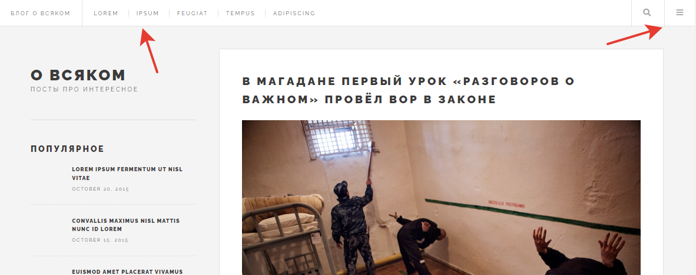
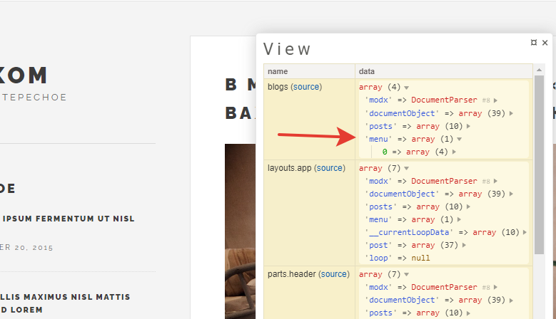

# Навигация по сайту

Давайте сделаем меню блога.
В дизайне меню выводится в двух местах: шапка блога и боковая панель, которая выезжает по нажатию на "гамбургер" справа. 



Я планирую разместить в обоих местах абсолютно одинаковые ссылки: "Главная, Блоги, Теги, Контакты".

## Получаем данные

Меню выводится на всех страницах. Значит,  в каждом контроллере писать свой метод для получения меню? 
А если что-то изменится, мы будем вынуждены поправить все имеющиеся контроллеры. Это не путь самурая.

Очень вовремя мы сделали BaseController, от которого наследуем все остальные контроллеры, не так ли?

Давайте сделаем отдельный метод для получения таких вот глобальных данных.

Добавьте этот код в `BaseController.php`:
```php
public function globalElements(){
	$this->data['menu'] = json_decode($this->evo->runSnippet('DLMenu',[
		'parents' => 0,
		'maxDepth' => 1,
		'api'=> 1,
	]));
}
```
Здесь мы закидываем в переменную `$data` ключ `menu`, в котором при помощи сниппета `DLMenu` строим менюшку. 

К сожалению, тут не работает параметр `returnDLObject` как у Доклистера, но зато есть параметр `api`, который вернёт нам json.

Теперь вызов метода `globalElements` надо прописать в `__construct`, иначе он так и останется неиспользуемым. Поправьте ещё немного `BaseController.php`.

```php
public function __construct()
{
	$this->evo = EvolutionCMS();
	$this->render();
	$this->globalElements();// вот он
	$this->sendToView();
}
```
Давайте протестируем?
Откройте любую страницу сайта и в панели Tracy зайдите во вкладку view



Из-за особенностей DLMenu наша менюшка там лежит под индексом 0. Это надо будет учесть.

Также учтите, что пункты меню - это объекты.

## Главное меню

Верхнее меню мы вынесли вместе с шапкой в файл `views/parts/header.blade.php`.

Откройте его и найдите разметку `<nav class="links">`.

Правим по аналогии с постами.

```html
<nav class="links">
	<ul>
		@foreach ($menu[0] as $item)
			<li><a href="{{ urlProcessor::makeUrl($item->id) }}">{{$item->pagetitle}}</a></li>
		@endforeach
	</ul>
</nav>
```
Обратите внимание, что здесь мы используем стрелки, а не скобки. Именно из-за того, что каждый `$item` это класс. Ну и нолик злополучный.

## Боковое меню

Боковое меню вынесено отдельно в файл `views/parts/menu.blade.php`.

Делаем там абсолютно то же самое.


Всё, сайт обзавёлся менюшками. Изучите на досуге то, что выдал нам Tracy в переменной `menu`. Там есть практически всё, чтобы создать меню неограниченной сложности.
Заодно пробегитесь по документации `DLMenu`ю


---
**Итого**
* Сделали меню
* Поняли, как круто, когда есть базовый контроллер.

---
Пора добить последний кусочек сайта, который ещё не трогали - [сделаем сайдбар](/010_%D0%A1%D0%B0%D0%B9%D0%B4%D0%B1%D0%B0%D1%80.md).