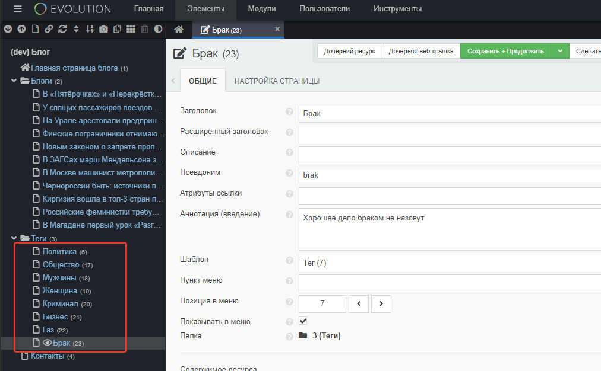
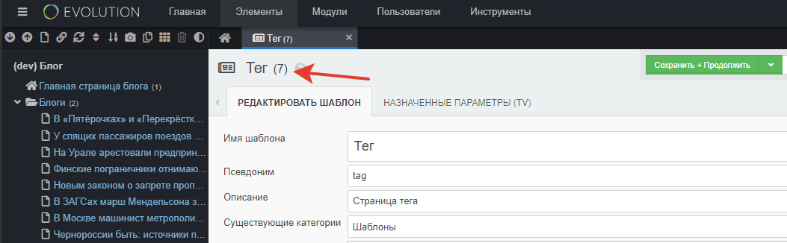
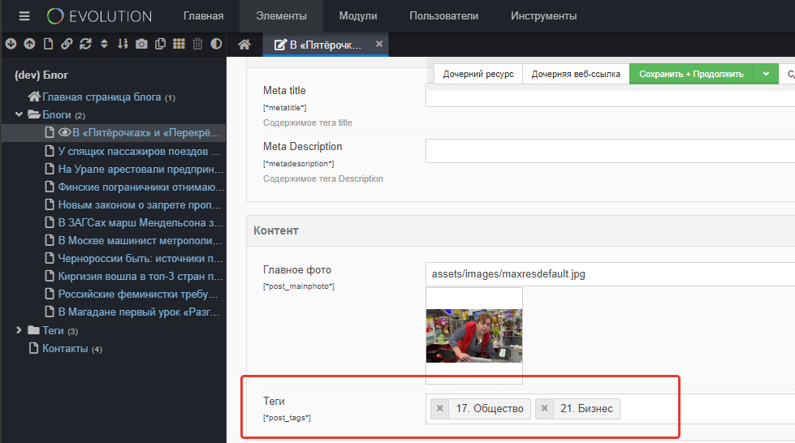
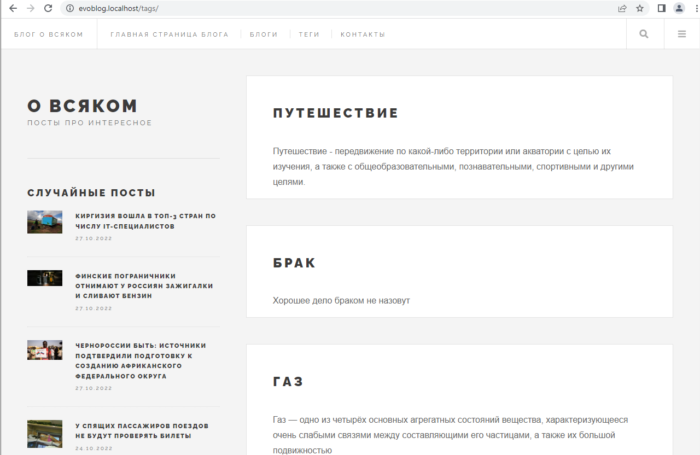
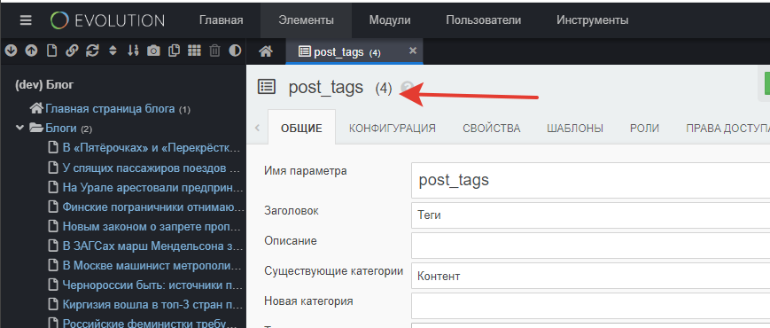
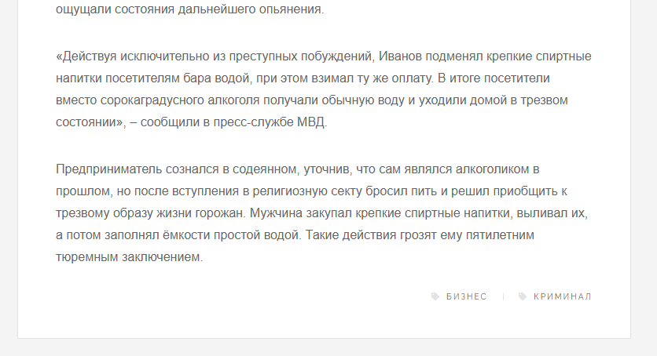

# Теги в блоге на Evolution CMS

Оглавление
* [Введение](#part1)
* [Настраиваем Selector](#part2)
* [Расставляем теги](#part3)
* [Введение](#part4)
* [Страница всех тегов](#part4)
* [Страница одного тега](#part5)
* [Страница одного поста](#part6)
* [Теги в ленте постов](#part7)


Задача: сделать теги для постов блога. 

* Количество тегов для каждого поста неограничено.
* У каждого тега в админке своя отдельная страница с мета-полями и описанием. 
* На фронте у тега есть страница с заголовком и постами, выбранными по этому тегу.
* Также есть общая страница всех тегов с их перечислением, кратким описанием тега и пагинацией.
* У каждого поста на фронте также есть теги.

Задача не самая простая, кстати. Она имеет множество решений в рамках Evolution CMS. Покажу одно из них.

## Введение <a name="part1"></a>

**Проверьте структуру**

Проверьте, что у вас есть шаблоны.

| Имя				|    Псевдоним      |  Описание  	|
|-------------------|:-----------------:|--------------:|
| Все теги 			|	tags 			| Лента тегов 	|
| Тег 				|	tag 			| Страница тега |

Проверьте, что у вас есть сами теги в дереве документов. Желательно создать штук шесть для начала, чтобы было что пагинировать.

 

## Настраиваем Selector <a name="part2"></a>

Дополнение Selector меняет внешний вид и функционал ТВ-параметра для возможности быстро выбирать ресурсы из дерева документов.

После выбора в поле через запятую перечисляются их идентификаторы.

Зачем это нужно? Чтобы легко и просто связывать документы между собой.

Из коробки Selector выбирает ресурсы по всему дереву документов. Давайте его слегка настроим и ограничим выборку только тегами.

Создайте файл
`assets/tvs/selector/lib/post_tags.controller.class.php`

И отредактируйте его

```php
<?php namespace Selector;
include_once(MODX_BASE_PATH.'assets/tvs/selector/lib/controller.class.php');
class Post_tagsController extends SelectorController {
    public function __construct($modx) {
        parent::__construct($modx);
        $this->dlParams['addWhereList'] = 'c.published = 1 AND c.template = 7';
    }
}
```

Selector использует для работы тот же знакомый нам Доклистер, поэтому параметр `addWhereList` вам должен быть знаком, если вы прочитали документацию.

Внимания заслуживает `c.template = 7`. Цифра семь - это идентификатор шаблона "тег".

У вас он может отличаться. Это не критично, просто поправьте под себя запрос, указав корректный номер.

 

## Расставляем теги <a name="part3"></a>

Заходите в посты и ставьте теги. От 1 до цать штук каждому посту.

 


## Страница всех тегов <a name="part4"></a>


Для начала выведем страницу всех тегов `/tags`. Это будет лента с названием тега и кратким описанием.

По аналогии с постами давайте создадим контроллер для этой страницы.

```php
<?php

namespace EvolutionCMS\Main\Controllers;

class TagsController extends BaseController
{
	public function render()
	{
		$result = $this->evo->runSnippet('DocLister', [
			'parents' => 3,
			'depth' => 1,
			'returnDLObject' => 1,
			'paginate' => 'pages',
			'display' => 10,
			'TplPrevP' => '@CODE: <li><a href="[+link+]" class="button previous">&laquo;</a></li>',
			'TplNextP' => '@CODE: <li><a href="[+link+]" class="button  next">&raquo;</a></li>',
			'TplPage' => '@CODE: <li><a class="button" href="[+link+]">[+num+]</a></li>',
			'TplCurrentPage' => '@CODE: <li class=" is-active">[+num+]</li>',
			'TplWrapPaginate' => '@CODE: <ul class="actions special pagination">[+wrap+]</ul>',
		]);
		$this->data['tags'] = $result->getDocs();
		return $this->data['tags'];
	}
}
```

И выведем полученный массив в шаблоне `views\tags.blade.php`:


```html
@extends('layouts.app')
@section('content')
    @foreach ($tags as $tag)
    <article class="tag">
        <header>
            <div class="title">
                <h2><a href="{{ urlProcessor::makeUrl($tag['id'] ) }}">{{ $tag['pagetitle'] }}</a></h2>
            </div>
        </header>
        {{ $tag['introtext'] }}
    </article>  
    @endforeach
    {!! $modx->getPlaceholder('pages') !!}
@endsection
```

Отлично, переходим на страницу и оцениваем результат:




## Страница одного тега <a name="part5"></a>

А вот тут будет посложнее. Логика действий следующая - нам надо выбрать все документы, в значениях post_tags у которых есть идентификатор текущей страницы.

Почему текущей? 
Допустим, тег "Путешествия"  id = 24.
Допустим пост "Еду в Магадан" имеет этот тег. Значит в его тв post_tags есть цифра 24.
Значит, когда мы откроем тег под номером 24, нам надо выбрать ресурсы, где 24 присутствует в поле post_tags.

Сделаем контроллер `TagController`
```php
<?php

namespace EvolutionCMS\Main\Controllers;

class TagController extends BaseController
{
	public function render()
	{
		
		$id = $this->evo->documentObject['id'];
		$res = $this->evo->db->select("contentid", $this->evo->getFullTableName('site_tmplvar_contentvalues'), "FIND_IN_SET('" . $id . "',value) AND tmplvarid=4");
		$arr = $this->evo->db->makeArray($res);
		foreach ($arr as $k => $v) {
			$documents[] = ($v['contentid']);
		}
		$documents = implode(",", $documents);
		$result = $this->evo->runSnippet('DocLister', [
			'idType' => 'documents',
			'documents' => $documents,
			'tvPrefix' => '',
			'tvList' => 'post_mainphoto',
			'paginate' => 'pages',
			'display' => 10,
			'returnDLObject' => 1,
			'TplPrevP' => '@CODE: <li><a href="[+link+]" class="button previous">&laquo;</a></li>',
			'TplNextP' => '@CODE: <li><a href="[+link+]" class="button  next">&raquo;</a></li>',
			'TplPage' => '@CODE: <li><a class="button" href="[+link+]">[+num+]</a></li>',
			'TplCurrentPage' => '@CODE: <li class=" is-active">[+num+]</li>',
			'TplWrapPaginate' => '@CODE: <ul class="actions special pagination">[+wrap+]</ul>',
		]);
		$this->data['posts'] = $result->getDocs();
		return $this->data['posts'];
	}
}
```

Логика действий этого контроллера довольно проста, хотя изначально может показаться запутанной.

Сначала мы выбираем все id всех постов, где в значениях присутствует id текущего тега `$this->evo->documentObject['id']` и где id ТВ-параметра равно 4. 

Что за 4 такая?

 

Делаем из массива строку, разбитую запятыми. Типа `2,3,32`.


Отдаём этот список Доклистеру, который, сюрприз, умеет выводить документы по их идентификаторам (это есть в документации).

Отдаём переменную `posts` в шаблон.

Сделаем шаблон для тега `views\tag.blade.php`

```html
@extends('layouts.app')

@section('content')
    <article class="post">
        <header>
            <div class="title">
                Посты по тегу <h1>{{ $documentObject['pagetitle']}}</h1>
            </div>
        </header>
        <section>{!! $documentObject['introtext'] !!}</section>
    </article>

    @foreach ($posts as $post)
        <article class="post">
            <header>
                <div class="title">
                    <h2><a href="{{ urlProcessor::makeUrl($post['id'] ) }}">{{ $post['pagetitle'] }}</a></h2>
                    <a href="{{ urlProcessor::makeUrl($post['id'] ) }}" class="image featured"></a>
                </div>
            </header>
            {{ $post['introtext'] }}
        </article>  
    @endforeach
    {!! $modx->getPlaceholder('pages') !!}
@endsection
```


## Страница одного поста <a name="part6"></a>

Давайте выведем теги на странице поста.
Откройте `post.blade.php` и выведите в произвольном месте значения параметра `post_tags`

```
@dump($documentObject['post_tags'])
```

Вы увидите что-то типа цифр `^ "19,17"`. Это порядковые номера тегов.

Нас это не совсем устраивает, мы хотим не идентификатор, а ссылку и тайтл тега.

Создаём контроллер для поста `PostController`

```php
<?php

namespace EvolutionCMS\Main\Controllers;

class PostController extends BaseController
{
    public function render()
    {
        $this->data['tags'] = null;
        $tags_array= $this->evo->documentObject['post_tags'];

        if($tags_array && $tags_array[1]){
            $result = $this->evo->runSnippet('DocLister', [
                'idType' => 'documents',
                'documents' => $tags_array[1],
                'tvPrefix' => '',
                'returnDLObject' => 1,
            ]);
            $this->data['tags'] = $result->getDocs();
        }
        return $this->data['tags'];
    }
}

```
Здесь мы получаем documentObject - все поля текущего документа. Из-за некоторых особенностей ТВ параметры при таком способе получения содержат не строку, а массив, описывающий тип, значения и некоторые другие сущности ТВ. Под ключом [1] содержится как раз значение.

Мы это значение получаем, подсовываем Доклистеру и просим его выбрать ресурсы тегов.
Отдаём в шаблон как `data['tags']` - это уже привычно.


Дописываем в шаблон поста `post.blade.php` цикл по полученной переменной:

```html

@section('content')
<ul class="stats">
    @foreach ($tags as $tag)
        <li><a href="{{ urlProcessor::makeUrl($tag['id'] ) }}" class="icon solid fa-tag">{{ $tag['pagetitle']}}</a></li>    
    @endforeach
</ul>
@endsection

```
И проверяем получившийся результат




## Теги в ленте постов <a name="part7"></a>

Самое сложное и неоднозначное - пожалуй, вывод тегов в общей ленте постов.
Я бы предложил вам на *начальном* этапе освоения cms этого не делать. И показывать теги только внутри конкретного поста.

Дело в том, что мы, конечно, можем адаптировать способ выше и пройтись по каждому посту, выбирая его теги вызовом Доклистера.
Но представьте себе количество запросов к базе данных, когда у нас будет 10 постов, содержаших по 2-3 тега. Это не путь самурая.

>Путь самурая - связывание и модели, но в рамках этого курса они не рассматриваются, зато есть в документации к Evolution CMS

Давайте попробуем придумать алгоритм, который бы позволил не множить запросы к БД.

Объясню на примере контроллера главной страницы. Для контроллера "Все блоги" будет абсолютно то же самое за исключением пагинации.

1. Выбрать все посты с ТВ post_tags.
2. Выбрать все id всех тегов, которые будут использованы на странице.
3. Получить эти документы одним единственным запросом.
4. Добавить к результату из пункта 1 объекты этих документов в какой-нибудь свой ключ.

Реализуем

```php
<?php

namespace EvolutionCMS\Main\Controllers;

class MainController extends BaseController
{
  public function render()
  {
    $result = $this->evo->runSnippet('DocLister', [
        'parents' => 2,
        'depth' => 1,
        'tvPrefix' => '',
        'tvList' => 'post_mainphoto,post_tags',
        'returnDLObject' => 1,
        'paginate' => 'pages',
        'display' => 10,
        'TplPrevP' => '@CODE: <li><a href="[+link+]" class="button previous">&laquo;</a></li>',
        'TplNextP' => '@CODE: <li><a href="[+link+]" class="button  next">&raquo;</a></li>',
        'TplPage' => '@CODE: <li><a class="button" href="[+link+]">[+num+]</a></li>',
        'TplCurrentPage' => '@CODE: <li class=" is-active">[+num+]</li>',
        'TplWrapPaginate' => '@CODE: <ul class="actions special pagination">[+wrap+]</ul>',
    ]);

    $result = $result->getDocs();
    $tags_ids = [];

    foreach ($result as $document) {
        $document['post_tags']  = explode(',', $document['post_tags']);
        $tags_ids = array_merge($tags_ids, $document['post_tags']);
    }
    $tags_ids = array_unique($tags_ids);

    $tags =  $this->evo->runSnippet('DocLister', [
        'idType' => 'documents',
        'documents' => implode(",", $tags_ids),
        'returnDLObject' => 1,
    ]);
    $tags = $tags->getDocs();

    foreach ($result as $document) {
        if ($document['post_tags']) {
            foreach (explode(',', $document['post_tags']) as $tag_id) {
                $result[$document['id']]['post_tags_custom'][] = $tags[$tag_id];
            }
        } else {
            $result[$document['id']]['post_tags_custom'] = [];
        }
    }
    $this->data['posts'] = $result;
    return $this->data['posts'];
  }
}

```


Где `post_tags_custom` - новое поле в массиве `posts`

Сущие мелочи - вывести `posts` в шаблоне.
```
<footer>
    <ul class="stats">
        @foreach ($post['post_tags_custom'] as $post_tag)
            <li><a href="{{ urlProcessor::makeUrl($post_tag['id'] ) }}" class="icon solid fa-tag">{{ $post_tag['pagetitle'] }}</a></li>
        @endforeach
    </ul>
</footer>
```


Повторите это в шаблоне и контроллере для страницы "Все блоги" `BlogsController`, но учитывая пагинацию.


---
**Итого**
* Заработала страница всех тегов
* Заработала страница одного тега
* В посте добавились кликабельные теги
* Во всех лентах материалов добавились кликабельные теги.
---

В процессе разработки мы накопили технический долг - много сущностей дублирует друг друга. Давайте слегка [оптимизируем код и шаблоны](/012_%D0%9E%D0%BF%D1%82%D0%B8%D0%BC%D0%B8%D0%B7%D0%B0%D1%86%D0%B8%D1%8F%20%D0%BA%D0%BE%D0%B4%D0%B0%20%D0%B8%20%D1%88%D0%B0%D0%B1%D0%BB%D0%BE%D0%BD%D0%BE%D0%B2.md).


