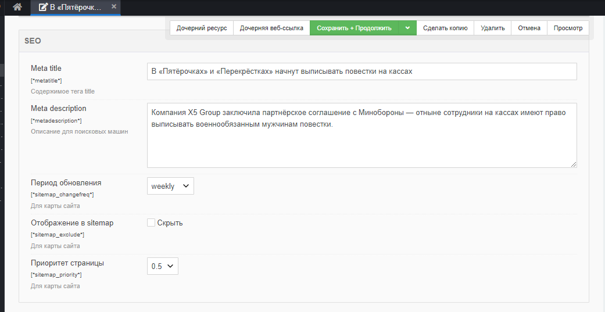

# XML и HTML карты

Для всякого сеошного на сайте должны присутствовать карты сайта.

Оглавление
* [HTML карта](#part1)
* [XML карта](#part1)


## HTML карта <a name="part1"></a>

Тут всё очень просто. 
1. Создаём в админке шаблон "Карта сайта HTML". Назначаем ему псевдоним `htmlsitemap`.
2. Создаём сразу `/views/htmlsitemap.blade.php` блейд-шаблон.
3. Создаём ресурс "Карта сайта HTML", выбираем ему шаблон. Не забудьте снять чекбокс "Показывать в меню".
4. Создаём контроллер `HtmlsitemapController`.
```php
<?php

namespace EvolutionCMS\Main\Controllers;

class HtmlsitemapController extends BaseController
{
    public function render()
    {
        $sitemap = $this->evo->runSnippet('DLMenu',[
            'parents' => 0,
            'maxDepth' => 3,
        ]);
        $this->data['sitemap'] = $sitemap;
    }
}
```
5. В шаблоне выводим переменную
```html
@extends('layouts.app')
@section('content')
    {!! $sitemap !!}
@endsection
```
Возможно, это несколько неверно, т.к. мы отдаём в блейд уже свёрстанный список. Но какой смысл городить огороды

## XML карта  <a name="part2"></a>

Вы можете воспользоваться похожим решением и сделать карту при помощи сниппета `DLSitemap`.
Способ практически тот же самый, что мы рассмотрели выше.

Однако для тренировки давайте воспользуемся другим решением и установим пакет `Evocms Sitemap XML` через консоль.

### Подготовка - создайте ТВ

В обоих случаях для карты сайта вам будут нужны ТВ-параметры, которые позволят задавать приоритет ресурсам, исключать их из карты сайта и задавать частоту обновления.

Создайте 3 ТВ параметра и назначьте их всем шаблонам блога.

Имя: `sitemap_changefreq`
Заголовок: `Период обновления`
Существующие категории: `SEO`
Тип ввода: `dropdown`
Возможные значения:
`always||hourly||daily||weekly||monthly||yearly||never`
Значение по умолчанию: `weekly`

Имя: `sitemap_exclude`
Заголовок: `Отображение в sitemap`
Существующие категории: `SEO`
Тип ввода: `checkbox`
Возможные значения: `Скрыть==1`
Значение по умолчанию: `0`

Имя: `sitemap_priority`
Заголовок: `Приоритет страницы`
Существующие категории: `SEO`
Тип ввода: `dropdown`
Возможные значения: `0.1||0.2||0.3||0.4||0.5||0.6||0.7||0.8||0.9||1`
Значение по умолчанию: `0.5`


Секция "СЕО" приобретает размах.


Кстати. Если вам не нравится, что в документе "СЕО" выше, чем "Контент", зайдите в `Элементы -> Категории`, найдите там сортировку категорий и расположите и так, как душе угодно.

### Установите дополнение evocms-sitemap

Открываем консоль сервера, переходим в папку `/core` и выполняем следующие команды:

```shell
php artisan package:installrequire 0test/evocms-sitemap "*"
```

```shell
php artisan vendor:publish --provider="EvolutionCMS\SitemapXml\SitemapXmlServiceProvider"
```

Обратите внимание - теперь в папке `packages` у нас два пакета. Один наш стартовый `main` и второй `sitemapxml`.

### Отредактируйте конфигурацию

Создайте папку `core\custom\packages\sitemapxml\config`.
Скопируйте туда файл `core\custom\packages\sitemapxml\example.config.php`, переименуйте в `config.php` и отредактируйте под свои нужды.

Значение `frequency_default` ставьте такое же, как значение по умолчанию у ТВ `sitemap_changefreq`. А `priority_default` как `sitemap_priority`.

Теперь попробуйте открыть урл `http://evoblog.localhost/sitemap.xml`.

---
**Итого**
* Есть карты сайта
---

Переходим к созданию поиска по блогу.