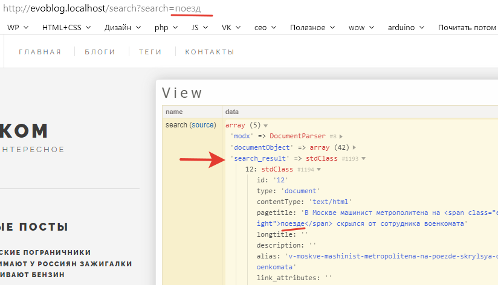
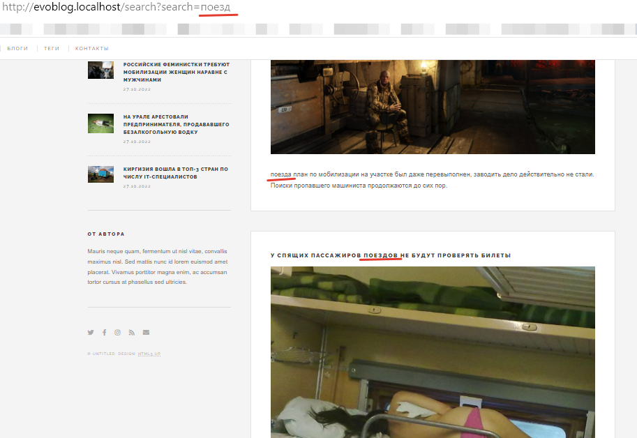

# Поиск по блогу в Evolution CMS

## Установка EvoSearch

Сначала установим EvoSearch. 
Открывайте модуль Extras в админке, вводите в поиск название и устанавливайте.

До самого первого запуска нужна индексация ресурсов. Это делается просто:
* открываем `Элементы-Плагины`, ищем там evoSearch и во вкладке "Конфигурация" и выставить параметры в плагине:
	* Переиндексировать все = 1
	* Первая строка переиндексации = 0
	* Строк за сеанс индексировать = 100
* Снимите чекбокс "Плагин отключен", сохраните плагин.
* Откройте и сохраните любой документ.
* Теперь можно вернуться в плагин и снова поправить параметры:
	* Переиндексировать все = 0
	* Строк за сеанс индексировать = 1

## Шаблоны и поиск


### Страница результатов 

Сделаем шаблон с псевдонимом `search` и названием "Поиск". Разумеется, ставим чекбокс, чтобы создался файл `/views/search.blade.php`.
Можно назначить шаблону СЕО ТВ.

Пока что содержимое шаблона оставим вот таким:
```html
@extends('layouts.app')
@section('content')
	результаты поиска
@endsection
```

Создайте в админ-панели страницу для результатов поиска с этим шаблоном.
Я убрал чекбокс "Показывать в меню" - мне она там ни к чему. Псевдоним ресурса у меня будет `search`.

### Формы поиска

Форм у нас две. Первая в файле `views/parts/header.blade.php`, вторая в `views/parts/menu.blade.php`. В обоих флах нам надо сделать следующее.
* Параметр action направить на созданную страницу результатов.
`action="{{urlProcessor::makeUrl(26)}}"` где 26 - это мой id страницы. У вас он будет другой.
* Текстовому полю назначить имя `name="search"`.

Можете попробовать воспользоватся формой. После нажатия на отправку вы должны перейти по адресу `http://evoblog.localhost/search?search=термин`.

> Иногда бывает ошибка. Попробуйте [этот](https://github.com/webber12/evoSearch/issues/31) фикс.

Итак, формы работают. Теперь нужно получить запрос и отдать результаты.

## Получение результатов


Супер-простой способ, когда некогда.

`search.blade.php`
```html
@extends('layouts.app')

@section('content')
    {!! $modx->runSnippet('evoSearch',[
        'tpl' => 'evoSearch'
    ]) !!}
@endsection
```
При этом решении мы вызываем сниппет из шаблона и берём для разметки чанк в админке. Старый подход из версии 1.4. Не рекомендую.

Более правильный способ.

Создаём шаблону результатов контроллер `SearchController`:

```php
<?php
namespace EvolutionCMS\Main\Controllers;

class SearchController extends BaseController{

    public function render()
    {
        $result = $this->evo->runSnippet('evoSearch',[
            'api' => 1,
            'show_stat' => 0,
        ]);
        $this->data['search_result'] = json_decode($result);
    }
}
```
И всё. В переменной `search_result` лежат все результаты работы.

Разумеется, у сниппета есть различные опции, которые вы [найдёте в документации](https://github.com/evocms-community/docs/blob/master/ru/04_Компоненты/evoSearch/index.md). Я показал базовое использование.

> Как и многие другие крутые решения, сниппет базируется на Доклистере. Прочтите документацию к нему.




## Шаблонизация результатов

Изучите полученные массивы и обратите внимание на их ключи. Там кое-что добавилось, и мы можем это использовать.

Если результат поиска есть в поле `pagetitle`, то сниппет добавляет свою разметку. Например:
```
'В Москве машинист метрополитена на <span class="evoSearch_highlight">поезде</span> скрылся от сотрудника военкомата'
```

Добавилось поле `extract` (краткая выдержка найденного), в котором точно такой же функционал:
```
'<span class="evoSearch_highlight">поезда</span> план по мобилизации на участке был даже перевыполнен, заводить дело действительно не стали. Поиски про … о сих пор.'
```

Разумеется, помимо этого, есть и все обычные поля, с которыми мы работали до этого.

Делаем разметку `search.blade.php`

```html
@extends('layouts.app')

@section('content')
    <article class="post">
        <header>
            <div class="title">
                <h1>Поиск по сайту</h1>
            </div>
        </header>
    </article>
    @foreach ($search_result as $result)
        <article class="post">
            <header>
                <div class="title">
                    <h3><a href="{{ urlProcessor::makeUrl($result->id ) }}">{!! $result->pagetitle !!}</a></h3>
                </div>
            </header>
            <p>{!! $result->extract !!}</p>
        </article>
    @endforeach
@endsection
```

Собственно, ничего нового. Разве что обратите внимание, что pagetitle и extract вызваны без экранирования.

Дело как раз в том `span` для подсветки найденного слова. Это html и его надо вывести в "сыром" виде.

Стилизуйте его на свой вкус, я оставлю всё так, как есть.


## Советы и хинты

А как быть, если хочется выводить в результатах ТВ-параметры? Скажем, картинку из поста.

Вспоминаем, что evoSearch базируется на Доклистере и в вызов добавляем опции:
```php
$result = $this->evo->runSnippet('evoSearch',[
    'api' => 1,
    'tvPrefix' => '',
    'tvList' => 'post_mainphoto',
    'show_stat' => 0,
]);
```
А в шаблон переменную
```html
<div class="featured image">
    post_mainphoto}}" alt="">
</div>
```
В результатах есть фотография.




---
**Итого**
* Блог обзавёлся поиском
---

Остаётся только "причесать" блог -- в таком виде сайт нельзя сдавать клиенту. [Приступим к мелочам](/015_%D0%9D%D0%B0%D0%B2%D0%B5%D0%B4%D0%B5%D0%BD%D0%B8%D0%B5%20%D0%BA%D1%80%D0%B0%D1%81%D0%BE%D1%82%D1%8B.md).

