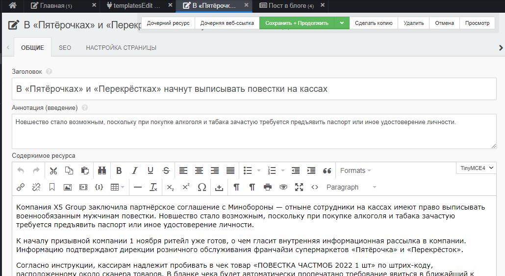
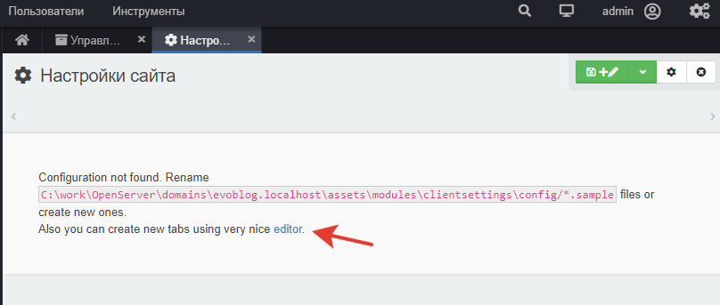
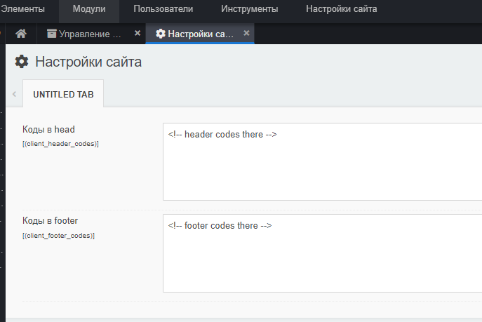
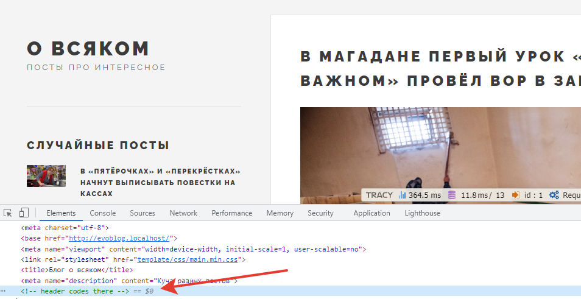

# Разные мелочи 

* [Убираем ненужные поля из шаблонов админки](#part1)
* [СЕО - метатеги](#part2)
* [Метрика, аналитика и любые другие коды ](#part3)


## Убираем ненужные поля из шаблонов админки <a name="part1"></a>
По умолчанию при редактировании ресурса вы видите добрый десяток полей, каждое из которых можете использовать. Но в нашем случае нужны штук пять, не более.

Давайте позаботимся о контент-менеджере и сделаем красиво.

### templatesEdit3

Зайдите в Extras и установите дополнение templatesEdit3. Это дополнение для кастомизации полей при редактировании документов.

Сразу  откройте  редактирование любого ресурса - внешний вид уже изменился.

Однако, я настрою te3 под себя. 

Открываем в админ-панели любой шаблон, с которого хотите начать. Скажем, "Пост в блоге". Обратите внимание на появившуюся вкладку "Template builder". Именно там и происходит вся настройка шаблонов. Описывать её детально  бессмысленно - всё делается мышкой. Тащим поля куда хотим, убираем те, что не нужны, группируем по секциям или вкладкам.

Я накликал себе нечто подобное


Если вы сделали нечто универсальное, то нажмите "По умолчанию для всех". Это позволит распространить внешний вид на все шаблоны.

Дальше редактируйте уже конкретные шаблоны под свои нужды.
Я поправлю шаблоны тег и главная - уберу у них поле  контент. Ведь там мы ничего не заполняем, зачем путать редактора? 
Таким же образом и вы пройдитесь по сайту, редактируя и убирая ненужное.


## СЕО - метатеги <a name="part2"></a>

Если вы обращали внимание, на блоге у нас нет ни корректных тайтлов, ни метатегов.

Давайте это исправим. 

Нам нужно: 
* Сделать title из поля metatitle, если оно заполнено. Если нет, пусть тайтлом будет заголовок.
* Сделать meta description из поля metadescription, если оно заполнено. 

Весь тег `<head>` у нас остался в шаблоне `app.blade.php`.

Можно воспользоваться директивой `@if`, а можно чуть короче:
```html
<title>{{ $documentObject['metatitle'] ? $documentObject['metatitle']  : $documentObject['pagetitle'] }}</title>
<meta name="description" content="{{ $documentObject['metadescription'] ? $documentObject['metadescription']  : $documentObject['introtext'] }}" />

```

Если логика тегов у вас будет сложнее, можно даже вынести это всё в BaseController. 
Только не забудьте, что доступ к текущему документу из контроллера это
```php
$this->evo->documentObject
```
А ТВ-параметры - массивы, где под ключом [1] содержится их значение.
```
  "metadescription" => array:5 [▼
    0 => "metadescription"
    1 => "Компания X5 Group заключила партнёрское соглашение..."
    2 => ""
    3 => ""
    4 => "textareamini"
  ]
  ```


## Метрика, аналитика и любые другие коды <a name="part3"></a>

Давайте позаботимся о тегах различных поисковых систем, трекинга и аналитики.

Самый простейший вариант - вставить код в любой кусочек шаблона, который повторяется везде. У нас это `parts.header`. Или даже сразу в `layouts.app`.

Этот подход хорош, если вы используете сайт для себя. Но заставлять заказчика лазать по шаблонам - плохая идея. Если и справится, то обязательно что-то сломает.

### ClientSettings
Давайте установим решение, которое позволило бы создать "переменные", доступные на всём сайте.
Найдите в Extras `ClientSettings`, установите его. 

Зайдите в "Модули" и запустите. Вы увидите примерно такую картину:



Дополнение просит вас либо вручную создать файл конфигурации, либо воспользоваться редактором. Жмём на `editor`и создаём два поля.
Названия: header_codes и footer_codes
Заголовки: Коды в head, Коды в footer

Тип для обоих полей рекомендую выбрать `Textarea(mini)`.
Сохраняйте всё, жмите "Обновить страницу" в браузере. В самом верхнем меню должна появится опция "Настройки сайта". Вот там заказчик и может вписывать разные коды, аналитики, телефоны и вообще любую информацию, которую нужно менять часто и которую, разумеется, вы ему настроите.

Давайте пока что для отладки впишем в коды что-нибудь.



### Выведем в шаблон

Откройте `app.blade.php` и в нужных местах добавьте вызов конфигурации с нужными ключами.
```php
{!! $modx->getConfig('client_header_codes') !!}
```
и
```php
{!! $modx->getConfig('client_footer_codes') !!}
```

Проверьте исходный код сайта 



Подобным образом можно давать клиенту безопасно и довольно гибко управлять различными изменяемыми областями на сайте.

---
И это - последний из рассказов о Маугли.

Готовый сайт по этому курсу вы можете скачать на [гитхабе](https://github.com/0test/evoblog.localhost). Логин/пароль - admin/admin, база данных лежит в корне.

Вопросы и пожелания задавайте в [чате](https://t.me/evo_cms) комьюнити.

Спасибо автору вы можете отправить на Сбер  5469120010280898, или Яндекс [410011160949342](https://yoomoney.ru/to/410011160949342).